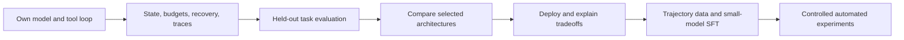

# Python agent engineering and local-model post-training: working roadmap

Reviewed September 9, 2026. Scope: documentation and representative source inspection, not execution or a production audit. Career recommendations provisionally target applied AI/agent engineering, while retaining a later post-training path. No paid AgentWay content was accessed.

This document captures the discussion so far. It is a working roadmap for gradual refinement, not a commitment to complete every stage or purchase particular tools. Python is the confirmed implementation language. The immediate next step is to begin the author's Python from-scratch tutorial on September 9, 2026.

## Motivation and original research idea

The starting question was whether a solo developer could specialize an existing open-weight model for agent work, learn the full post-training and evaluation process, and eventually explore automated research and recursive self-improvement (RSI) at an affordable scale.

The inspiration was an [InfoQ article republished on Sohu](https://www.sohu.com/a/1072817483_355140) about StartLux-V1.0-27B-Preview, an adaptation of Qwen3.6-27B. StartLux publishes an overall task success rate of 39.25%, versus 33.91% for its Qwen baseline: a gain of 5.34 percentage points in a six-model comparison attributed to CAICT testing over three rounds. These are reported results, not results independently reproduced in this work. [Company results](https://startlux.com/).

The interesting hypothesis is that targeted training can improve tool selection, argument construction, multi-step execution, recovery, constraint retention, and completion verification. Parameter count alone does not determine success: the model and the surrounding harness both matter.

The public starting checkpoint is [Qwen3.6-27B](https://huggingface.co/Qwen/Qwen3.6-27B). It is already post-trained; further specialization does not require starting from a raw pretrained checkpoint. As of the September 8 research, no downloadable StartLux checkpoint or complete reproducible training recipe was verified. The practical opportunity is therefore a smaller methodological reproduction, with our own measured baseline, rather than a promised reproduction of the company's score.

Two related objectives shape the roadmap:

1. Build and understand agents and harnesses deeply enough to explain, debug, and deliver them as an AI engineer.
2. Use that infrastructure to study whether targeted post-training improves a small model's agent behavior.

Building the harness first directly supports the training objective: it creates the environment, traces, evaluators, and failure cases that make training useful and measurable.

## Confirmed preferences and provisional choices

| Status | Decision |
|---|---|
| Confirmed | Python throughout the implementation and training pipeline |
| Confirmed | Learn by building from scratch, with gradual discussion and scope refinement |
| Confirmed | Keep the workload and cost realistic for one personal developer |
| Confirmed | Turn progress into demonstrable interview assets |
| Confirmed next step | Begin the Python from-scratch learning resource today |
| Proposed | Use a small repository-maintenance agent as the continuing portfolio project |
| Proposed | Start later training experiments around 4B parameters using adapters |
| Still open | Exact project domain, target job descriptions, hardware, weekly study time, model, and actual spending limit |

The repository-maintenance idea is a candidate, not a settled product specification. A small file or database task environment with objective success checks could serve the same purpose.

## Recommendation

Use one project as the curriculum: a small repository-maintenance agent that reads an issue, inspects files, proposes a patch, runs allowlisted checks in a disposable workspace, and reports evidence. Start with deterministic tools and a bounded model/tool loop, add runtime reliability and evaluation, compare selected designs, then train a model only after failures can be measured.

## Resource assignments

| Resource | Assignment | Limitation |
|---|---|---|
| pguso/agents-from-scratch (Python) | Primary starting curriculum: model calls, decisions, tools, loops, memory, evals, telemetry | Curriculum checked at README level; implementation still needs review |
| pguso/ai-agents-from-scratch (JavaScript) | Optional companion explanations and comparison examples | Do not translate the entire course; some mechanics remain inside node-llama-cpp |
| wquguru/harness-books | Design companion after a minimal agent works | Independent commentary and pseudocode, not a runnable course or verified current vendor architecture |
| FareedKhan-dev/all-agentic-architectures | Selective pattern experiments after baseline evaluation | LangGraph-based; broad catalogue and permissive demonstration benchmarks |
| AgentWay | Lower-priority optional conceptual material and recall practice | TypeScript/SDK-oriented introductory path adds translation overhead; paid exercise quality unverified |

### From-scratch resource

The [README](https://github.com/pguso/ai-agents-from-scratch) provides a progressive path and links to a separate [Python companion](https://github.com/pguso/agents-from-scratch). The latter advertises an evolving agent plus evaluation and telemetry lessons; it was checked at README level only.

For this roadmap, start with **`pguso/agents-from-scratch`**, the Python repository. The similarly named **`pguso/ai-agents-from-scratch`** is the JavaScript repository originally discussed. There is no need to learn TypeScript to follow the plan.

The JavaScript [ReAct example](https://github.com/pguso/ai-agents-from-scratch/blob/main/examples/09_react-agent/react-agent.js) uses library-managed tool functions and stops when generated text contains an answer marker. Reimplementing explicit tool dispatch and robust terminal statuses would deepen the learner's understanding. Avoid treating generated reasoning text as verified internal reasoning.

### Harness books

Source inspection at commit fbf2b43 covered the README, contents, sample chapters and source maps. Start with Book 1 chapters 1 and 3 for state and the loop; 4 and 6 for tool execution and recovery; 5 for context management. Convert each into an implementation and failure-injection exercise. [Loop chapter](https://github.com/wquguru/harness-books/blob/main/book1-claude-code/locales/en/chapter-03-query-loop-heartbeat.md).

The source maps do not pin upstream implementations adequately to reproduce all internal-product claims. Use design arguments as hypotheses, and check current product behavior against official sources. The README describes AgentWay as related but separate; its promotion is not an independent endorsement. [Repository](https://github.com/wquguru/harness-books).

### Architecture catalogue

Source inspection at cf9d620a8cc55d59589399c30f305e6dfaa428ec found a 35-pattern library. Select Tool Use, Planning/PEV, then one memory or retrieval pattern motivated by failures. Compare designs on identical tasks and budgets.

Its [RLHF-named module](https://github.com/FareedKhan-dev/all-agentic-architectures/blob/main/src/agentic_architectures/architectures/rlhf.py) uses critique, revision and an in-memory example archive; it does not update weights. Its [benchmark task definitions](https://github.com/FareedKhan-dev/all-agentic-architectures/blob/main/benchmarks/tasks.yaml) include substring and tool-count checks insufficient to establish task completion. Treat the leaderboard as demonstration evidence.

### AgentWay

The [introductory lesson](https://agentway.dev/en/learn/docs/basics) starts with Claude Agent SDK and includes an alternative SDK example. This is useful for assembling an application but delegates runtime mechanics. Its [pricing](https://agentway.dev/en/pricing) lists $79 once and says the first two stages are free; the evaluation page inspected separately presented a premium preview. Verify actual lesson access before buying.

Use free material first and purchase only if its structure helps complete working exercises. The public [SFT preview](https://agentway.dev/en/learn/docs/sft-agents) contains overly categorical limits on SFT's ability to teach knowledge or reasoning; use original research and training-library documentation for that later phase. [STaR](https://arxiv.org/abs/2203.14465) provides a concrete counterexample involving fine-tuning on verified reasoning.

## Evidence to build for interviews

- A runnable repository and understandable architecture diagram.
- A held-out task suite plus deterministic assertions on final artifacts.
- Baseline versus changed-system results: success, latency, tokens/cost, and regressions.
- Failure traces covering malformed calls, timeout, interruption and false completion.
- Explicit separation of harness improvements from changes to model weights.
- An explanation of what the developer personally implemented and can debug unaided.

Complement the project with Python/backend fundamentals, async execution, SQL, testing, deployment, retrieval evaluation, and basic ML/statistics. Specialized model-training roles require a deeper PyTorch, optimization, inference and experiment-design track. Do not treat course completion as proof of interview readiness.

## Curriculum built around observable milestones

Advance when the behavior is understood and demonstrated. These are learning gates, not a fixed calendar or a requirement to implement every feature immediately.

| Stage | Build and learn | Evidence to keep | Interview discussion |
|---|---|---|---|
| 1. Own the basic loop | Model request, structured tool request, validation, dispatch, observation, bounded continuation | Small runnable agent; trace of one full task | What does the model choose, and what does the program enforce? |
| 2. Make the harness reliable | Explicit state, limits, tool IDs, timeouts, cancellation, recovery, persistence as needed | Failure-injection cases and before/after traces | What happens when a tool fails or a run is interrupted? |
| 3. Measure behavior | Task fixtures, outcome checks, development/test separation, cost and latency accounting | Versioned evaluation runner and baseline report | How do you know the agent improved? |
| 4. Compare architectures | Add planning, verification, retrieval, or memory only for a measured problem | Controlled comparison with the simpler baseline | When is additional orchestration worth its cost? |
| 5. Deliver a usable application | Repeatable setup, CLI/API, isolation, operational logs, small deployment | Demonstration, architecture diagram, setup instructions | Can another engineer operate and troubleshoot it? |
| 6. Specialize a small model | Validated trajectories, adapter SFT, checkpoint loading, held-out evaluation | Dataset description, adapter/configuration, measured gains and regressions | Why train, and which failures did the weight update address? |
| 7. Explore outcome-based learning | Small resettable environment and verified rewards; optional GRPO | Reward definition, rollout analysis, cost accounting | Why is the reward meaningful, and how can it be exploited? |
| 8. Automate bounded research | Failure analysis, hypothesis, experiment, evaluation, retain/revert | Experiment ledger including unsuccessful hypotheses | What prevents the system from overfitting the evaluation? |

The initial Python stack can remain small: a model client behind an interface you own, ordinary functions for the loop, Pydantic for input validation, JSONL for traces, and pytest for deterministic checks. Add SQLite for persistence and asyncio for cancellation/concurrency when needed. Write a separate behavioral evaluation runner. These are proposed implementation choices, not new infrastructure to install all at once.

After building the first loop, compare an equivalent workflow in a framework such as LangGraph. Being able to explain what the framework supplies is part of the learning objective. A CLI is sufficient initially; a frontend is optional.

## Initial scope for model training

Proposed first research question:

> Can targeted adapter training improve a small model's recovery from tool errors and its verification of completion on unseen tasks?

Begin with short tasks using a few file or database tools, or a tightly constrained repository workflow. Introduce missing files, incorrect arguments, incomplete observations, and recoverable errors. Verify final artifacts and constraints programmatically. Long browser sessions and a broad general-purpose agent can come later.

Use an existing instruction-tuned model as the starting point. [Qwen3-4B-Instruct-2507](https://huggingface.co/Qwen/Qwen3-4B-Instruct-2507) was identified as a practical learning candidate, not as a claim about the strongest current small model. Begin with supervised fine-tuning using LoRA/QLoRA; leave full-parameter training and the 27B scale for a later decision. QLoRA trains small adapters while keeping the main weights quantized. [TRL SFT documentation](https://huggingface.co/docs/trl/sft_trainer).

Collect hundreds of verified trajectories first and increase the dataset only when useful. Include tool schemas, assistant tool calls, actual tool observations, and corrected recovery behavior. A stronger model may help generate or repair examples, but accept demonstrations based on execution checks rather than fluent explanations. Track dataset provenance and confirm applicable model/data/provider terms when choosing the actual sources.

Keep two kinds of improvement separate:

| Comparison | What it helps establish |
|---|---|
| Original weights, original harness vs original weights, improved harness | Effect of orchestration/context/tool changes |
| Original weights vs adapted weights, both with the same fixed harness | Effect of post-training |
| Optional evaluation of all four model/harness combinations | Whether the improvements interact |

Hold model inference settings, tasks, and execution budgets constant within each comparison. Keep training data, development feedback, and final test cases separate, preferably splitting by task family as well as individual examples. Repeated use of a development set can overfit it even if no examples enter training. Repeat promising comparisons and inspect task-level differences before claiming a small gain.

Measure task success, constraint violations, false completion, recovery success, latency, tokens/cost, and a modest general-capability regression suite. Training loss alone does not establish useful agent behavior.

### Benchmark resources

- [MCP-Universe repository](https://github.com/SalesforceAIResearch/MCP-Universe): code, tasks, evaluators, and environment setup. Domain configurations are under `mcpuniverse/benchmark/configs/test/`.
- [Paper](https://arxiv.org/abs/2508.14704) and [project/leaderboard](https://mcp-universe.github.io/): methodology and comparison context.

MCP-Universe covers real tools for search, navigation, browsers, finance, repositories, and 3D design. Its environment dependencies make a small local task suite a more manageable first step. Public task definitions can inform task design, but reserve evaluation cases from training. A modified local suite must be reported as such; its results are not directly comparable with the CAICT or public leaderboard results without matching conditions.

### Cost assumptions and controls

The initial discussion proposed **US$100–300 as a possible ceiling for the first complete small-model training experiment**, including a few failed attempts. This is an estimate for planning, not a verified reproduction cost, approved spending limit, or guarantee of improvement. Early agent-loop learning does not require that training budget.

A 24GB GPU was a plausible starting target for a small-model QLoRA smoke test with modest context and batches. Actual memory requirements depend on the model, context length, optimizer, and implementation. Local inference fitting on a device does not imply local training will fit. Local deployment is the eventual capability; temporarily renting a GPU for training is compatible with that objective.

Prefer renting before buying hardware. Count the whole experiment: training, trajectory generation, repeated evaluations, model APIs, tool services, storage, and idle resources. Generating long agent rollouts can cost more than the adapter-training run. Check current rental rates when selecting hardware; the earlier pricing discussion was a dated snapshot, not a standing quote. [Rental pricing reference](https://www.runpod.io/pricing).

Control cost with short tasks, small development evaluations, cached stable fixtures, bounded retries, token/step limits, and explicit experiment-hour caps. Broaden evaluation only for promising checkpoints. Defer online RL until the environment and reward are reliable. [TRL GRPO documentation](https://huggingface.co/docs/trl/grpo_trainer).

### Automated research and RSI

Distinguish the mechanisms clearly:

- **Distillation/SFT:** learn from stronger-model demonstrations or other verified examples through weight updates.
- **Inference-time feedback or memory:** change prompts, context, or stored examples without updating model weights.
- **Automated research:** an AI proposes hypotheses, runs experiments, interprets results, and selects the next experiment.
- **RSI:** the improved system also becomes better at producing subsequent improvements. A rising task score alone does not demonstrate this.

[Karpathy's autoresearch](https://github.com/karpathy/autoresearch) is a useful later reference for an experiment/retain/revert loop, but is not a ready-made agent post-training pipeline. For the first automated experiments, keep a fixed evaluator, a limited change surface, a development set, a held-back final test, and hard resource limits. Human control over objectives and promotion criteria remains appropriate.

## Turning work into a reusable interview asset

Maintain one evolving project rather than accumulating disconnected tutorial copies. At each meaningful milestone, save:

1. The problem and original failure, including a trace or task fixture.
2. The hypothesis and design change, with the alternatives considered.
3. The evaluation conditions and actual results, including unsuccessful experiments.
4. The cost, latency, complexity, or generalization tradeoff.
5. What was personally implemented and what libraries or AI assistance supplied.

A practical project layout might include `agent/`, `tools/`, `evals/`, `experiments/`, and `docs/`, with data preparation and training folders added later. Keep secrets out of recorded traces and shared artifacts. Record code/model versions and relevant configurations so results can be reproduced.

A future resume bullet should report measured facts, for example: “Built a Python tool-using agent with persistent execution state and automated evaluation; improved held-out task success from [measured baseline] to [measured result] while tracking [latency/cost tradeoff].” These brackets are placeholders, not results already achieved.

Practice a short demonstration, a deeper design walkthrough, and unaided debugging. Prepare to explain when a script is sufficient, why retries can duplicate side effects, how context differs from persistent state, how a verifier can be wrong, and how to distinguish harness gains from weight-training gains. Role-specific preparation still needs to be aligned with actual target job descriptions.

## Starting today: a deliberately small session

1. Open [pguso/agents-from-scratch](https://github.com/pguso/agents-from-scratch), the Python companion, and follow its actual setup instructions. Review the required model and hardware before downloading. This document does not claim the code has already been tested on this machine.
2. Read the introductory material and get one basic model interaction working. If setup takes the session, record the blocker and its resolution; there is no need to rush through the lessons.
3. When the tutorial reaches tools, trace one request all the way from the model's tool selection through execution to the next observation. Change one input and predict the effect before running it.
4. Write a short learning note: what ran, what was confusing, what the code controls, and what remains inside a library.

First milestone: explain a model/tool round trip in your own words and reproduce a tiny version without copying. Evaluation, frameworks, GPU training, and automated research are later extensions of that foundation.

The recurring study routine is **read one concept → implement → deliberately break → measure the fix → explain without notes**. Use AI for hints, reviews, and adversarial test cases, while periodically implementing a small component unaided. Tutorial progress becomes an interview asset when it produces understanding and evidence.
