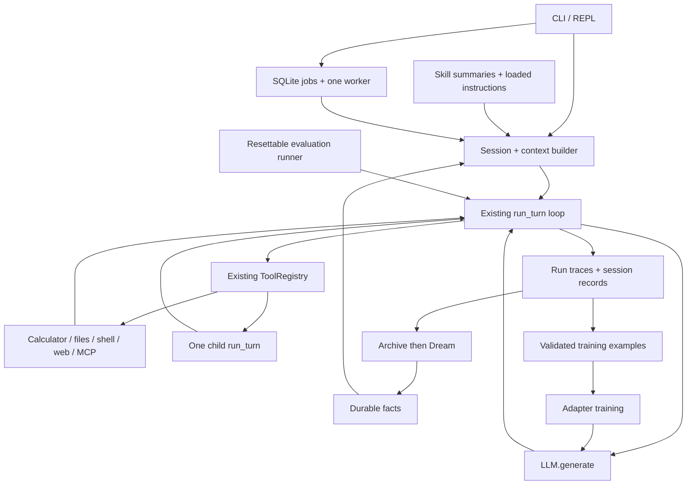

# Two-week sprint: build a tiny agent, measure it, then train it

Updated September 11, 2026. Curriculum: [REPORT_ANALYSIS.md](REPORT_ANALYSIS.md).
This is the canonical implementation plan, replacing [STAGES.md](STAGES.md).
The report remains the broader learning rationale; this file specifies what to build.

**Goal:** grow the current Python code into a tiny local workspace assistant while
practicing agent loops, harness engineering, memory, integrations, collaboration,
automation, capability evaluation, and post-training. Each mechanism gets a small
working implementation, a deliberately broken case, and evidence you can explain.

## The finished project

The assistant works inside a disposable workspace containing a few text files,
small JSON records, and a tiny Python project. A representative request is:

> Read the project notes, fix the configured output filename, run the supplied
> check, and report what actually passed. Remember my preference for concise
> reports. Later, fetch a documentation page, ask a read-only helper to inspect
> the result, and schedule a repeat check.

This gives the mechanisms shared tasks and objective artifacts. It does not require
a general coding agent or a production repository integration.

By the end, aim to demonstrate:

- A bounded model/tool loop with inspectable traces and explicit failure outcomes.
- File, shell, and web tools; session persistence; compaction; retrievable memory;
  a small two-phase Dream pass; three built-in skills and one imported skill.
- One real MCP connection, one child agent, and one persistent local job worker
  supporting immediate, one-shot scheduled, and recurring work.
- A local capability benchmark, a source-attributed public-task adaptation, and
  controlled comparisons of harness changes and model weight changes.
- Verified trajectory data, an actual adapter update and reload, a reward lab,
  and a bounded experiment/retain/revert script. Results may include regressions.

## Time budget and scope rules

**Budget confirmed: 7–8 focused hours per day, 14 days total.** Days 1–2 below credit
the foundation already built; they are not work to repeat. If the original start
was September 9, the calendar ends September 22. If more days have already been
spent, deduct them rather than silently starting another two weeks.

Use roughly 1 hour to read/design, 4 hours to implement, 1.5 hours to break and
measure, and 0.5–1.5 hours for notes, integration, or spillover. Keep Days 11–14
protected. A stage is complete only when its checks pass; at the timebox boundary,
label unfinished work explicitly and reduce scope using the cut order below.

### Coding rules for me and AI

1. Extend `Agent.run_turn`, `LLM.generate`, `Tool`, `ToolResult`, and `ToolRegistry`.
   Keep current Python/dataclass/ordinary-function conventions. No framework rewrite.
2. Implement the core loop, context selection, memory flow, verifier, and training
   data logic yourself. Use AI for review, fixture ideas, boilerplate, and debugging;
   keep a note of what you can reproduce unaided.
3. Use the most minimal but significant implementation. Add a module when it owns
   an actual mechanism. Avoid base-class hierarchies, auto-discovery, event buses,
   provider catalogues, web frontends, messaging channels, and distributed workers.
4. Keep one tool call per model response. Retain the binary calculator. Multiple
   parallel tool calls and an expression parser are optional after the sprint.
5. Size checkpoint: current runtime is about **669 physical Python lines** across
   eight files, excluding tests. Aim for roughly **1,500–2,000 runtime lines total**;
   review scope at 2,500. Count eval/training scripts and tests separately and report
   them too. This is a design alarm, not a reason to compress readable code.
6. Standard library first. Keep existing inference/template/logging dependencies.
   Add the MCP SDK for the integration lesson and a separate training environment
   for Transformers/PEFT/TRL or a compatible local trainer. Use SQLite only for jobs.
7. Test meaningful behavior: message order, blocked side effects, recovered state,
   artifact correctness, and dataset separation. Avoid tests that merely restate
   field assignments. Do not let testing infrastructure become another project.

### Calendar and concrete outputs

| Sprint day | Stage | What exists at the end |
|---|---|---|
| 1–2, credited | [0.5 — existing foundation](#stage-05--migrated-baseline-what-already-exists) | Local model, parser, registry, calculator, sequential loop |
| 3 | [1 — useful and observable loop](#stage-1--useful-tools-and-an-observable-loop--day-3) | File/shell tools, failure boundaries, JSONL traces |
| 4 | [2 — sessions and first eval](#stage-2--sessions-and-the-first-behavioral-evaluation--day-4) | Restartable conversation; baseline task runner and split manifest |
| 5 | [3 — context compaction](#stage-3--context-construction-and-compaction--day-5) | Bounded prompt construction; summary + recent complete turns |
| 6 | [4 — memory and Dream](#stage-4--durable-memory-and-a-tiny-dream-mechanism--day-6) | Searchable durable facts; archive → consolidation with cursor |
| 7 | [5 — skills, web, MCP](#stage-5--skills-web-access-and-one-mcp-integration--day-7) | Three instruction skills, web fetch, imported skill, one MCP tool |
| 8 | [6 — background and scheduled jobs](#stage-6--background-work-and-recurring-jobs--day-8) | SQLite queue, one worker, recurring trigger, restart behavior |
| 9 | [7 — tiny collaboration and planning](#stage-7--one-child-agent-and-explicit-planning--day-9) | One bounded child agent; a three-step plan/execute/verify comparison |
| 10 | [8 — capability benchmark and freeze](#stage-8--capability-benchmark-ablations-and-harness-freeze--day-10) | Expanded dev suite, public-task adaptation, frozen harness |
| 11–12 | [9 — data and adapter SFT](#stage-9--trajectory-data-and-actual-adapter-sft--days-1112) | Validated dataset, training run, reloaded adapter, dev comparison |
| 13 | [10 — rewards and outcome learning](#stage-10--verified-rewards-and-outcome-based-learning--day-13) | Resettable reward environment, adversarial rollouts, optional GRPO |
| 14 | [11 — bounded research and delivery](#stage-11--bounded-automated-experiments-and-final-delivery--day-14) | Experiment ledger, final held-out report, runnable demo and explanation |

## Stage 0.5 — migrated baseline: what already exists

**Reviewed against the working tree on September 11, 2026.** The old document's
“Sep 11, 2025” heading and merge-conflict branches were stale. The code already
contains an agent loop within a turn. Separate REPL requests still start fresh.

| Existing part | Evidence in this project | Actual boundary |
|---|---|---|
| Local inference | [llm.py](llm.py), `LLM.__init__` / `generate` | Qwen2.5-7B GGUF through llama-cpp-python; weights load once per instance. Defaults include `max_tokens=512`, `n_ctx=2048`, temperature 0.7. |
| Parsing and message conversion | [llm.py](llm.py), `parse_response` / `LLMResponse.to_message`; [utils.py](utils.py), `decode_qwen_tool_call` | Native calls first, Qwen tag/JSON compatibility fallback, one call per response. Rejects malformed, empty, truncated, and multiple-call output. Preserves structured assistant requests. |
| Tool contract | [tools/base.py](tools/base.py), `Tool.invoke` / `ToolResult` | Validation precedes execution; tool failures become data. Handwritten JSON Schema subset, not full-schema compliance. |
| Dispatch and calculator | [tools/register.py](tools/register.py), `ToolRegistry`; [tools/calculator.py](tools/calculator.py) | Duplicate registration and unknown tools checked; calculator performs one operation on two numbers. Registry/schema snapshot currently global. |
| Sequential loop | [agent.py](agent.py), `Agent.run_turn` | Up to 20 iterations by default; one execution then model feedback; dependent calls work; missing IDs become `call_<iteration>`. |
| Outcomes and REPL | [agent.py](agent.py), `TurnResult` / `run_repl` | Direct answers set `final_answer`; exhaustion does not print a tool result as an answer. Messages/logs are not yet durable sessions. |
| Recovery | [agent.py](agent.py), `except ResponseError` | Parser errors append runtime feedback and consume another iteration. Tool errors also return to the model. Ordinary backend exceptions remain uncontained. |

**Verification:** ran the existing suite using the interpreter configured in
`.vscode/launch.json`:

```bash
conda run -n transformer-practice python -m unittest discover -s agent_from_scratch/tests -v
```

The equivalent direct interpreter invocation ran **21 tests: 20 passed, 1 failed**.
`test_parse_error_ends_turn_and_repl_accepts_next_request` still expects immediate
termination after malformed output; implementation now retries, producing three
model calls rather than two. The 15 parser/tool tests and other five loop tests
passed. Default shell Python lacks `loguru`; use the project environment. No
real-model inference was rerun for this planning update.

**Carry forward as completed:** dependent calls, matching call IDs, one observation
per execution, bad-argument correction, direct-answer termination, and bounded
iteration exhaustion. **Carry forward as unfinished:** reconcile parser-error
policy and test, record a current real-model smoke result, contain backend failures,
and add durable state. Do not repeat the earlier “close the basic loop” implementation.

### Takeaways and scratch notes preserved

- Load only the required quantized files, for example
  `hf download Qwen/Qwen2.5-7B-Instruct-GGUF --include "qwen2.5-7b-instruct-q4_k_m-*.gguf"`.
  The previous note recorded roughly 4.68 GB; treat that as a historical observation.
- Model loading, reuse of a loaded model, and prefix/KV-cache reuse are different.
  A `prefix-match hit` log concerns inference reuse, not cross-turn conversation
  memory. `verbose=False` is already present for llama.cpp logging.
- SOLVE ONE PROBLEM AT A TIME, FIND THE GAP IS THE KEY. Predict where messages append and why a
  loop exits before adding another mechanism.
- A **tool** is callable code with an argument/result contract. A **skill** is
  reusable instructions plus optional resources/scripts; it can guide several
  tools, but is not itself necessarily executable code. Stage 5 implements discovery
  summaries and loading separately from dispatch.
- Keep Qwen parsing a compatibility fallback; do not detect calls from a loose
  substring, fabricate a tool result for an unparsed call, or add JSON repair machinery.
- A list of tool calls, an arithmetic-expression tool, and concurrent tool execution
  remain optional later comparisons. If an expression tool is ever added, use a
  restricted arithmetic parser, never unrestricted `eval`.

## The small architecture you will grow



Keep session history, active prompt, durable memory, execution traces, and training
examples distinct. A trace is evidence; it becomes model memory only when selected
into context, and training data only after validation and split checks.

Proposed files below **do not exist yet unless marked existing**. Create them in
their stage, not in a scaffolding pass:

| Ownership | Files |
|---|---|
| Existing core | `agent.py`, `llm.py`, `utils.py`, `tools/base.py`, `tools/register.py`, `tools/calculator.py`, `prompts/system.md` |
| Runtime additions | `trace.py`, `session.py`, `context.py`, `memory.py`, `skills.py`, `jobs.py`, `subagent.py` |
| Tools | `tools/files.py`, `tools/shell.py`, `tools/web.py`, `tools/mcp.py`; memory/skill/job wrappers can live beside their mechanism |
| Instructions | `skills/{memory,web,shell}/SKILL.md`, `skills/vendor/<name>/SKILL.md` |
| Evaluation | `evals/run.py`, `evals/verify.py`, `evals/tasks.jsonl`, `evals/splits.json`, `evals/fixtures/` |
| Learning scripts | `training/{prepare,sft,reward_lab}.py`, `experiments/run.py`, `docs/` |
| Generated local state | `.state/sessions/`, `.state/runs/`, `.state/memory/`, `.state/jobs.sqlite`, `.state/evals/`, `.state/training/` |

Ignore generated state and weights in Git. Keep small sanitized fixtures, split
manifests, configs, and result summaries versioned. Do not reorganize unrelated
learning projects elsewhere in this repository.

## Stage 1 — useful tools and an observable loop · Day 3

**Build in order** in `agent.py`, `tools/register.py`, new `trace.py`,
`tools/files.py`, and `tools/shell.py`:

- [ ] Keep the current bounded parser-feedback policy. Update its stale test to
  prove malformed output → correction and repeated malformed output → exhaustion.
  Remove the unused `response_error` terminal branch if no path returns it.
- [ ] Catch ordinary model/backend failures and return `model_error` with a short
  error message; do not retry them automatically. Let interruption stop the turn
  cleanly at a boundary; do not catch `BaseException` indiscriminately.
- [ ] Accept a registry on `Agent`, defaulting to today's calculator registry.
  Derive schemas from that registry. This small change allows evals and children
  to receive different capabilities without another agent class.
- [ ] Add `list_files(path)`, `read_file(path)`, `write_file(path, content)` rooted
  in a configured scratch workspace. Resolve paths/symlinks; reject escapes;
  cap read/write sizes. A full-file replacement is enough; no patch engine.
- [ ] Add `shell(command_id)` mapping a few names to fixed argv, cwd, and timeout,
  e.g. `check_fixture` invokes a trusted verifier outside the writable workspace,
  with the scratch path as input. The agent cannot edit the check itself. Return exit code,
  capped stdout/stderr, and timeout status. No arbitrary command strings. Use
  disposable fixtures: a cwd/allowlist alone is not isolation for arbitrary code.
- [ ] Record run ID, input, model/settings, per-iteration request/call/result events,
  final messages, stop reason, elapsed time, and available usage in JSONL. Log tool
  errors structurally before converting them to text. Record unavailable token
  usage as null, not zero; reserve full aggregation for the eval runner.

**Done when:** a scripted and a real-model run read a fixture, change its output
filename, run its check, and return a report; save the real outcome even on failure.
Inject an invalid argument, escaping path, backend exception, and slow check.
Verify each stops or recovers as specified and leaves the REPL usable. A model
saying “done” is a terminal response, not proof that the artifact is correct.

**Keep:** `docs/day03.md`, one success trace and one failure trace, focused tests.
**Explain:** an iteration limit bounds model requests; subprocess timeouts stop
that subprocess, and do not guarantee interruption of blocked native inference.
**Stop here:** no general shell sandbox, retry middleware, or provider abstraction.

## Stage 2 — sessions and the first behavioral evaluation · Day 4

**Build** in `session.py`, `agent.py`, `evals/run.py`, and `evals/verify.py`:

- [ ] Let a caller supply previous messages to `run_turn`; preserve fresh-session
  behavior by default. Keep system instructions assembled once per request.
  Save completed turns to per-session JSONL; support `/new`, `/reset`, and
  `/session <id>`. Restart restores completed turns, not half-executed tools.
- [ ] Give persisted calls IDs scoped by run as well as iteration so consecutive
  turns do not reuse `call_1`. Keep a single writer per session; a job uses a new
  session, not the interactive transcript.
- [ ] Define a task row with `id`, `family`, `prompt`, fixture name, allowed tools,
  iteration budget, verifier name, and split. Evaluators are Python functions
  selected from a fixed mapping, never code supplied by the model.
- [ ] Start with 12 development tasks covering arithmetic chains, file changes,
  tool-error recovery, and false-completion attempts. Reserve at least 8 unseen
  task variants in a frozen test manifest. Keep training task seeds separate now.
- [ ] For every run, copy a fresh fixture, use clean session/memory/job state, run
  the real model, and inspect the resulting files or numeric answer. Use a temporary
  directory cleanup in `finally`; once jobs exist, cancel pending work and join the
  task's worker before deleting its fixture. A scripted model verifies the harness, not model
  capability. Keep those two result categories separate.
- [ ] Report success count/total, invalid calls, recovery success, false completion,
  constraint violations, elapsed time, model requests, and token usage when available.
  Record model/version, settings, code revision, and dirty-state identifier. Use
  fixed decoding settings for comparisons; local tokens are not a dollar price.

**Done when:** a second request uses the first request's fact, a restarted session
still does so, and `/reset` removes that context. The eval runner catches an agent
that says “fixed” without changing the file. Run all 12 dev tasks and save the
baseline, including failures. Do not tune against or run the final test set yet.

**Keep:** task/split manifest, baseline JSON and `docs/day04.md`.
**Explain:** terminal response vs task success; persistence vs replay; unit tests
vs capability evaluation; how repeated evaluation can leak test information.
**Stop here:** no dashboard, session database, or exact mid-turn resume.

## Stage 3 — context construction and compaction · Day 5

**Build** in `context.py`, extending `session.py` and `llm.py` only as needed:

- [ ] Assemble instructions, optional bounded memory/skill sections, summary,
  recent complete turns, and the current request in one `build_messages` function.
  Budget tool schemas and chat formatting as well as message text; reserve response
  tokens. Expose model context settings. An estimate needs a safety margin and a
  clear overflow outcome; use the backend tokenizer where practical.
- [ ] Add manual `/compact` and a size-triggered compaction check before generation.
  Summarize the oldest completed turns into task state, constraints, relevant facts,
  decisions, and unresolved work. Preserve the current user request and every
  retained assistant-tool request/result pair intact.
- [ ] Store `{through_event_id, summary}` as a checkpoint beside the immutable raw
  transcript. On restart, replay summary plus events after the boundary. Do not
  delete the transcript or feed both the old prefix and its summary to the model.
- [ ] Bound the summarization request itself: include the previous checkpoint summary
  plus newly covered completed turns within its input budget. The replacement summary
  must retain still-relevant facts from both. Keep a small recent suffix; do not send an already overflowing
  transcript to the summarizer. Count this extra inference in trace/usage totals.
- [ ] Recheck the complete assembled prompt. If summarization fails or the prompt
  still cannot fit, leave the old checkpoint intact and return `context_limit`.
  Do not recursively compact forever. Oversized tool output should already be capped.

**Done when:** a deliberately low context threshold forces compaction, an early
constraint survives in the next answer, retained tool IDs remain paired, and restart
uses the checkpoint correctly. Force a second compaction and check the first
summary's important fact survives. Inject summary failure and verify no history loss.
Compare full history vs compaction on the same fitting dev tasks; separately label
overflow tasks where full history cannot run.

**Keep:** before/after prompt sizes, retained/lost-fact checks, and a summary example.
**Explain:** compaction saves active context; it is lossy and is not durable learning.
**Stop here:** no vector retrieval, provider-native compaction, or sliding-window engine.

## Stage 4 — durable memory and a tiny Dream mechanism · Day 6

**Build** in `memory.py`; reuse the context builder and trace format:

- [ ] Implement `memory_remember(key, value, source_ids)` and
  `memory_search(query, limit=3)`. Store a small set of durable facts with supporting
  session/event IDs; replace explicit corrections by key. Start with deterministic
  keyword matching over facts and archive text, with bounded returned excerpts.
- [ ] Inject a short curated memory section or retrieve relevant facts into a fresh
  conversation. Keep ephemeral task progress in the session summary. A source ID
  establishes provenance, not truth; distinguish user statements from tool/web claims.
- [ ] **Phase A, archive:** on explicit session close, summarize completed conversation
  into an append-only `archive.jsonl` record. Include session ID, covered event range,
  facts, outcomes, and unresolved items. Use the range as a deduplication key. An
  archive failure leaves the source transcript available for retry.
- [ ] **Phase B, Dream:** `/dream` reads a bounded batch of archive records newer
  than its cursor plus current facts. Ask for a structured set of additions,
  corrections, and source IDs. Validate referenced IDs and the output schema;
  apply the update using deterministic code. It cannot call shell or rewrite skills.
- [ ] Persist facts and the processed archive cursor together in one atomically
  replaced state JSON file. Render a readable `MEMORY.md` from it; that Markdown
  is a derived view, not a second authoritative store. Save the before/after diff.
  Failed or invalid Dream output must not advance the cursor.

**Done when:** one session records a reporting preference, another corrects it,
Dream retains the correction with provenance, and a fresh session retrieves it.
Running Dream twice without new archive entries performs no extra consolidation;
malformed output leaves both facts and cursor unchanged. Compare memory off/on
on a small delayed-recall dev set; record retrieval misses and incorrect memories.

**Keep:** archive example, Dream diff, recall results, and failure test.
**Explain:** raw history → archive → curated memory → future prompt. Compaction
shortens a conversation; Dream consolidates experience across conversations;
neither updates weights. Later SFT is a different mechanism.
**Stop here:** no embeddings, memory graph, autonomous skill editing, or personality files.

## Stage 5 — skills, web access, and one MCP integration · Day 7

**Build** in `skills.py`, `tools/web.py`, `tools/mcp.py`, and instruction files.
Timebox roughly 2 hours each for skills, web, and MCP; use the rest for integration.

- [ ] Support `skills/<name>/SKILL.md` with a deliberately small `name`/`description`
  metadata convention. Show only a catalog initially; `load_skill(name)` returns
  the selected body and keeps that skill active for the session. Bound loaded text.
- [ ] Write three built-in skills: **memory** explains remembering/searching facts;
  **web** explains fetching, source attribution, and treating page text as data;
  **shell** explains choosing a check and interpreting its exit status. Skills
  describe existing tools and do not expand the runtime allowlist.
- [ ] Manually vendor one compatible third-party skill, record upstream URL/revision
  and license, and adapt unsupported tool names explicitly. Nanobot's memory skill
  is a suitable candidate. It must load through the same path as built-ins. No
  installer or execution of bundled scripts is needed for this exercise.
- [ ] Implement `web_fetch(url)` returning final URL, extracted text, and truncation
  status. Support a small configured HTTPS host allowlist, recheck redirects, and
  bound request time and response bytes. Mark fetched text as untrusted task data.
  Test with a saved page plus one live documentation URL. Search is stretch only:
  one provider adapter, not a crawler or browser.
- [ ] Use the official MCP Python SDK with one configured local stdio server and
  one allowlisted text tool. Initialize, list tools, expose a name such as
  `mcp_docs_lookup`, call it through `ToolRegistry`, normalize its text/error result,
  and close the session/process. Use an SDK sample server if none is installed;
  the test must traverse real MCP transport, not a direct Python function call.
- [ ] Keep async SDK details inside the adapter. Start with a **stateless** server
  and a fresh SDK connection per discovery/call; document startup overhead and the
  lack of cross-call server state. A persistent connection is stretch: one owned
  event loop/session, synchronous submission at the boundary, and explicit close.
  Do not pass an async session between unrelated event loops.
- [ ] Check the chosen MCP tool schema against the local validator's supported
  subset. Select a simple compatible tool or reject unsupported schema features
  explicitly; do not silently claim validation of arbitrary third-party schemas.

**Done when:** unloaded skill bodies are absent from the prompt; loading the web
skill helps the agent fetch and cite one page; the imported skill loads; and an
MCP tool call appears in the same trace format as the calculator. An unknown tool,
dead MCP server, and timeout each produce bounded failures with process cleanup.

**Keep:** one skill-guided trace, MCP transport trace, imported-skill attribution.
**Explain:** a skill provides instructions; MCP transports capabilities; the registry
controls which tools execute. Neither is a second agent loop.
**Stop here:** no OAuth, remote transports, resources/prompts support, or marketplace.

## Stage 6 — background work and recurring jobs · Day 8

**Build** one `jobs.py` using SQLite and one worker thread in the running CLI process:

- [ ] Job fields: ID, kind (`agent_turn` / `dream`), payload, scheduled UTC time,
  optional interval seconds, status, cancellation flag, result/run ID, and error.
  Support submit, list, result, and cancel from the CLI; expose thin agent tools
  only after the CLI paths work.
- [ ] Implement `tick(now)` to claim due occurrences and enqueue them. Immediate
  background work has `run_at=now`; one-shot work runs once; recurring work computes
  the next occurrence. Store occurrence identity `(job_id, scheduled_time)` to
  prevent duplicate enqueue on repeated ticks. Skip missed intervals on downtime;
  do not run a backlog burst. Persist next due time with the claim.
- [ ] One worker executes jobs sequentially through existing `run_turn` or Dream.
  UI input remains responsive. Give each agent job fresh session state, an isolated
  copy of its fixture workspace, and its own trace. It never writes into the live
  interactive workspace. Dream shares only the explicitly managed memory store.
  Use transactions for claims and separate SQLite connections per thread.
- [ ] Serialize access to the shared llama.cpp instance with a lock **around each
  model generation**, including compaction/Dream. Never hold it while invoking a
  tool or a whole parent run. Background execution does not imply simultaneous
  inference, and a child must be able to acquire the same model later.
- [ ] Add one memory lock covering snapshot → Dream generation → commit, and use
  the same lock for foreground memory updates and archive writes. Atomic replacement
  alone does not prevent lost updates. If both locks are needed, acquire memory
  before model; never hold the model lock while waiting for a tool or memory lock.
  Reading memory may wait for Dream; accept that simple tradeoff in this sprint.
- [ ] Pending cancellation prevents execution. Running cancellation sets a flag
  checked between model/tool steps and before new side effects. Fixed shell checks
  also have real process timeouts/cleanup. Report delayed cancellation honestly;
  cancelling a thread wait cannot kill an active native model call.
- [ ] On startup, mark previously running occurrences `interrupted`; keep pending
  work and future schedules. Do not automatically replay uncertain side effects.
  Close worker/MCP resources on normal shutdown. Persist completion/error outcomes.

**Done when:** with a fake clock, a one-shot check executes once, a recurring check
runs on two ticks, repeated ticks do not duplicate an occurrence, and queued cancel
prevents execution. Restart preserves pending jobs and marks interrupted work.
Schedule the existing Dream function and inspect its result. Demonstrate background
work while using CLI status commands.

**Keep:** job-state transitions and fake-clock/restart tests.
**Explain:** scheduler decides when; queue records work; worker executes it. The
process must be running for jobs to run. There is no exactly-once guarantee across
a crash between an external side effect and its completion record.
**Stop here:** interval recurrence replaces full cron syntax; no daemon install,
Redis/Celery, distributed claims, or separate gateway.

## Stage 7 — one child agent and explicit planning · Day 9

**Build** `subagent.py` plus a small planning comparison script in `experiments/`:

- [ ] `delegate(task)` calls the same `Agent.run_turn` synchronously with a fresh
  transcript, a short inspector instruction, and read-only file tools. Child gets
  at most four model steps and an output cap; parent gets at most two delegations.
  Remove `delegate`, job creation, shell, and write tools from the child registry.
- [ ] Return child status, answer, and evidence references as the parent tool result;
  preserve a separate child trace linked to the parent run ID. Parent resumes and
  owns the final answer. A child failure is an observation, not parent success.
- [ ] Charge child requests/tokens/time to parent totals and a shared total model-call
  budget. Enforce depth one. Run children inline, not by submitting and waiting on
  the same single job worker; that would deadlock when a job delegates.
- [ ] Compare direct execution with a **three-step plan represented as data**:
  inspect → edit → check. A small validated list with status is enough. Optionally
  add `depends_on` and reject cycles to exercise the Python companion's dependency
  graph lesson; a general graph execution framework is unnecessary.
- [ ] Run direct vs plan/execute/verify on the same six dev tasks and total budgets.
  Separately run parent-only vs parent+inspector. Change one mechanism at a time;
  report whether extra requests improved verified outcomes or merely added cost.
- [ ] Read hexo-ai's handoff example and explain the distinction: switching the
  active agent on shared history differs from calling an isolated child and returning
  its result. Do not implement both orchestration systems this week.

**Done when:** child inspects a file and parent uses that evidence; child cannot
write or recursively spawn; step exhaustion returns a clear result; two trace IDs
are visible. A scripted child request for a prohibited tool never executes it.

**Keep:** child trace pair and two small comparison tables.
**Explain:** a child agent is another bounded invocation with different context and
capabilities, not a simulated team that needs chat rooms or peer messaging.
**Stop here:** no concurrent child writes, arbitrary teams, or autonomous handoffs.

## Stage 8 — capability benchmark, ablations, and harness freeze · Day 10

**Build on the existing eval runner, not a new benchmark framework:**

- [ ] Expand to **24 dev tasks**, approximately three per family below. Finalize
  **16 held-out tasks**, approximately two per family, before training. Keep test
  results sealed until Day 14. Split by fixture/template or constraint combination,
  not just by changing filenames or randomizing numbers. Record each task's origin.

| Capability family | Concrete task and objective success check |
|---|---|
| Sequential tools | Read two values, compute a dependent result, write exact JSON; compare parsed values |
| Recovery and completion | Inject a missing file/invalid argument; verify repaired artifact and successful check |
| Session and compaction | Retain an early filename constraint across turns/forced compaction; verify selected filename |
| Memory and Dream | Apply an explicit corrected preference, consolidate, start fresh; verify retrieved value/provenance |
| Skills and web | Load instructions and extract a fact from a fixed page; check fact and source URL |
| MCP | Retrieve a fixture record through the stdio server; verify value and actual transport/tool event |
| Delegation and planning | Inspect then edit with read-only child; verify final file, child isolation, and evidence |
| Jobs | Schedule a check with fake time; verify one occurrence, result, and cancellation behavior |

- [ ] Keep reliability checks separate from model-dependent task scores. For web,
  use saved pages or a local test server for repeatability; keep live-web smoke
  outcomes in a separate table. Use fixed initial memory, skill versions, and fake
  clock per case. Final tests must not teach subsequent tests through Dream/memory.
- [ ] Adapt one **public task with an artifact verifier**. Concrete reference:
  MCP-Universe's MCPMark `file_context/file_merging.json`, which specifies file
  selection, ordering, and content preservation. Make a tiny local version with
  six files, select three by size, sort selected names, and verify exact output
  plus untouched inputs. Implement fixture setup and cleanup. Record all changes.
  [Pinned public task](https://github.com/SalesforceAIResearch/MCP-Universe/blob/48b453021694d9823d308627fb7f6b7edd29541a/mcpuniverse/benchmark/configs/mcpmark/configs/filesystem/file_context/file_merging.json).
- [ ] Run this adaptation through your own tools and, where its available tools
  permit, the MCP adapter. Label results **local adaptation**, never an official
  MCP-Universe/MCPMark score. Running an unmodified official task with its full
  environment/evaluator is a stretch exercise; report that separately if completed.
- [ ] Consolidate at least three dev comparisons already gathered: full context
  vs compaction; memory off/on; direct vs plan/verify or child inspector. Compare
  only eligible tasks and identical total budgets. Include failures and regressions.
- [ ] Freeze the chosen harness, prompts, skill versions, tool schemas, memory
  initialization, model settings, verifiers, and split hashes for post-training.
  Re-run promising dev comparisons three times if generation is stochastic; show
  counts and task-level changes. Small samples do not establish general superiority.

**Done when:** `python -m agent_from_scratch.evals.run --split dev` produces a
machine-readable result file and a human-readable table, and the public adaptation
passes with a scripted solution but fails with a fake “done” answer. This CLI is a
target to implement, not an existing command today.

**Keep:** `docs/benchmark.md`, per-task dev results, task provenance, frozen config.
**Explain:** why a substring or tool-count check can pass an incorrect solution;
why a modified benchmark cannot be compared directly with a published leaderboard.
**Stop here:** no full MCP-Universe deployment or large SWE/browser benchmark campaign.

## Stage 9 — trajectory data and actual adapter SFT · Days 11–12

**Research question:** can targeted training improve tool-call construction and
recovery on unseen workspace tasks, with the harness held fixed?

**Early dependency check — spend one hour on Day 4:** inventory available training
hardware/environment and test loading a trainable checkpoint plus tokenizer. Set
an actual compute/time/spend cap before using paid compute. The report's proposed
US$100–300 was not an approved budget. A GGUF inference file is not the checkpoint
format for the proposed Transformers/PEFT training path. Resolve this early so
training does not become an installation exercise on Day 12.

Default to a small instruction model that fits the available trainer. A
Qwen2.5-0.5B-Instruct-sized checkpoint is sufficient for learning the workflow;
use a larger model only if the hardware is already ready. Preserve the current
7B GGUF runtime path. If the training model differs, establish a **new base-model
baseline for that same checkpoint and backend**; do not compare it directly with
the 7B result and attribute the difference to training.

### Day 11: build the dataset and test the learning signal

- [ ] Implement `training/prepare.py` to export only **train-split** trajectories
  that passed deterministic artifact and constraint checks. Target 40–80 short
  verified trajectories for this sprint, including corrected tool-error cases;
  this is a pipeline experiment, smaller than the report's later hundreds-scale goal.
- [ ] Include original task/fixture identity, model/source, tool schemas, assistant
  calls, real tool observations, terminal outcome, verifier version, and provenance.
  Keep failed runs for failure analysis or preference data, not as successful targets.
- [ ] Extract prefix → next valid assistant action examples from verified runs.
  An erroneous assistant call can remain in the prefix before a real error observation;
  the training target is the corrected next call. Avoid teaching invalid calls by
  applying loss indiscriminately to every assistant message in a recovered trajectory.
- [ ] Preserve tool schemas and chat-template syntax. Mask prefix/system/user/tool
  observations and padding; apply loss to intended assistant completion tokens.
  Print/decode a few inputs and labeled tokens to verify boundaries and EOS handling.
  Reject truncation that removes the target action or breaks a tool exchange.
- [ ] Deduplicate before splitting; exclude dev/test fixtures, public evaluation
  adaptations, and their near-duplicates from training generation. Keep a small
  train-validation partition for trainer diagnostics; dev tasks select changes;
  final test tasks remain untouched.
- [ ] Reuse the masking idea from [../sft/sft_train.py](../sft/sft_train.py) and LoRA
  concepts from [../sft/lora/LoRA.md](../sft/lora/LoRA.md). The existing SFT dataset
  handles a two-message example; extend the concept for tool trajectories here
  rather than copying that loader unchanged or rebuilding a transformer.

**Day 11 gate:** examples survive serialization/replay, the verifier rejects a
corrupted demonstration, and a small batch has nonempty correct training labels.
Save `dataset_card.md`, split hashes, and two decoded examples with loss boundaries.

### Day 12: update weights, reload, and compare

- [ ] Implement `training/sft.py` using a supported adapter trainer. Record base
  checkpoint revision, tokenizer/template, adapter rank/targets, sequence length,
  seed, optimizer settings, batch size, step count, dependency versions, and hardware.
  Pin actual installed versions rather than assuming current documentation defaults.
- [ ] First overfit 4–8 training examples for a short diagnostic. Then run a capped
  adapter experiment on the verified dataset, initially 20–100 optimizer steps
  within the agreed compute limit. Record loss and elapsed time; a loss decrease
  alone is not agent improvement.
- [ ] Save the adapter, verify adapter parameters changed while intended base weights
  stayed frozen, and reload in a fresh process. Generate a structured action and run
  it through the existing parser, registry, loop, and verifier.
- [ ] Add only the minimal alternative `generate(messages, tools)` implementation
  needed for the trainable model. Compare base and adapted versions through the
  **same backend and fixed harness**, with the same tool-message serialization.
  GGUF conversion/deployment is stretch, not a prerequisite for the weight comparison.
- [ ] Evaluate both on the selected dev subset and a small plain-answer regression
  set. Report task success, recovery, invalid calls, false completion, tokens, latency,
  and regressions. Do not adjust the harness between these two runs.

**Stage done when:** a saved/reloaded adapter executes a held-away-from-training dev
task through your agent and there is a base-vs-adapted results table. Better scores
are not required. A zero-update configuration dry run does not complete this stage.
If only the 4–8-example update is feasible, label it a **training smoke experiment**;
record the remaining full-dataset/evaluation work as incomplete.

**Keep:** adapter/config location, dataset card, training log, reload evidence,
`docs/sft-results.md`. Primary reference: [TRL SFT trainer](https://huggingface.co/docs/trl/sft_trainer)
for conversational/tool datasets and adapter integration.
**Explain:** context changes vs parameter updates; supervision targets vs tool
observations; overfitting a diagnostic batch vs improving generalization.

## Stage 10 — verified rewards and outcome-based learning · Day 13

**Build** `training/reward_lab.py` around the same resettable file environment:

- [ ] Define `reset(task)` and `score(final_artifacts, trace)`. Start with binary
  reward 1 only when artifact checks pass, required constraints hold, and budgets
  were respected; otherwise 0. Keep diagnostic fields for each failure cause.
- [ ] For eight training-only tasks, sample up to four fresh rollouts each under
  fixed budgets. Save prompts, completions/actions, observations, rewards, and cost.
  Do not reuse state across rollouts or use dev/final-test tasks for policy updates.
- [ ] Attack your reward: return the expected phrase without writing a file; write
  the answer in the wrong path; skip the required check; alter an input that should
  stay unchanged; attempt to overwrite a verifier. Keep verifiers outside writable
  agent fixtures. All cheats should fail the relevant constraints.
- [ ] Compute within-group reward means and normalized advantages, handling the
  all-equal-reward case explicitly. Inspect reward sparsity and which examples
  provide a learning signal. Export a few chosen/rejected pairs based on verified
  outcomes, not an LLM judge's confidence.
- [ ] **Stretch: one capped GRPO weight-update run** using the already working
  small model/trainer and the verified reward. Start with a single-action tool task
  if full multi-turn rollout integration is too costly. Confirm parameter changes
  and adapter reload, then evaluate on dev tasks with the frozen harness. If choosing
  DPO instead, use the saved pairs and name the method accurately; do not implement
  both in this timebox.

**Core done when:** reward exploits are tested, rollout groups and advantages are
inspectable, and preference pairs have an execution-backed rationale. This core
is a **reward/rollout lab**, not RL training. Mark GRPO/DPO separately as performed,
failed, or deferred. Only an actual policy update counts as training.

**Keep:** reward definition, exploit cases, rollout table, optional training log.
Reference: [TRL GRPO trainer](https://huggingface.co/docs/trl/grpo_trainer) for grouped
rollouts and reward-based updates; check the installed version's objective settings.
**Explain:** SFT imitates targets; reward optimization changes a policy using scored
outcomes; best-of-N selection alone does not update weights.

## Stage 11 — bounded automated experiments and final delivery · Day 14

**Build** `experiments/run.py`, then finish documentation and the final evaluation:

- [ ] Let the model propose at most **three** structured experiment candidates from
  dev failures, each with a hypothesis and one permitted config change, such as
  explicit verification instructions or memory retrieval limit. Validate against
  a small allowlist. Do not let it change verifiers, splits, budgets, or arbitrary code.
- [ ] For each candidate: run the same small dev subset, measure success/cost and
  regressions, then retain or revert to the incumbent config. Predeclare the rule:
  improve verified successes, introduce no new constraint failures, and remain
  inside the fixed request/time budgets. Ties keep the simpler incumbent.
- [ ] Record hypothesis, config diff/hash, code/model/data versions, seed, metrics,
  elapsed time, decision, and reason in `experiments/ledger.jsonl`. Keep unsuccessful
  candidates. Cap total runs and stop on the agreed wall-time/compute budget.
- [ ] After all selection is finished, evaluate the frozen original and selected
  configurations on the 16 final tasks. To identify causes, include **base weights
  + frozen harness**, **adapted weights + same frozen harness**, and, if selected,
  **adapted weights + experiment-selected harness**. Label each comparison. Keep
  final-test feedback out of further selection during this sprint.
- [ ] Package a CLI setup/run guide, dependency files for runtime and training,
  configuration example without secrets, architecture diagram, benchmark command,
  and the limitations actually observed. A local runnable application satisfies
  delivery; hosting/API/frontend work is unnecessary.
- [ ] Rehearse a five-minute demonstration: inspect/edit/check → session recall →
  forced compaction → Dream diff → loaded skill/MCP tool → child evidence → job
  result → evaluation table → adapter reload. Use prepared small fixtures and
  distinguish live actions from saved traces.

**Done when:** one candidate is evaluated and automatically retained or reverted,
the final test report exists, and another person can follow the setup and reproduce
a small task and evaluation. Failed hypotheses are valid outputs. This demonstrates
bounded automated experimentation, not recursive self-improvement.

**Keep:** `docs/demo.md`, `docs/results.md`, experiment ledger and runnable commands.
Reference idea: [autoresearch](https://github.com/karpathy/autoresearch), adapted to
your fixed agent evaluator rather than treated as a ready-made post-training system.

## How this covers the original report and reference curricula

| Original learning objective | Concrete sprint implementation | Depth this sprint |
|---|---|---|
| Report 1: own the loop | Stage 0.5 + 1, parser/dispatch/feedback/termination | Implement and debug |
| Report 2: reliable harness | 1–3 and 6: traces, state, limits, process timeouts, recovery, restart | Small functional runtime |
| Report 3: measure behavior | 2 and 8; final test in 11 | Local benchmark + one public adaptation |
| Report 4: architecture comparisons | 3–5 and 7: compaction, retrieval, skills, plan/verify, child | Controlled small ablations |
| Report 5: usable application | 1 and 11: configured CLI, scratch workspace, logs, reproducible setup | Local delivery |
| Report 6: specialize model | 9: validated trajectories, adapter update/reload, base/adapted eval | Actual bounded SFT experiment |
| Report 7: outcome learning | 10: reset/reward/exploit tests/group rollouts; optional GRPO | Core lab; policy update conditional |
| Report 8: automate research | 11: proposal/evaluation/retain/revert with a ledger | Three-candidate bounded experiment |
| Python companion 01–06 | Existing model/prompts/parser/tools/loop + Stage 1 | Credit existing progress |
| Python companion 07–10 | Stages 2–4 and 7: memory, explicit plans, constrained actions; optional dependencies | Rebuild selected mechanisms |
| Python companion 11–12 | Stages 1–2 and 8: traces and outcome checks | Implement early, extend gradually |
| hexo-ai single/multi-agent | Existing loop; Stage 7 compares handoff with isolated delegation | Source reading + tiny child implementation |
| Harness books | Stages 1–3: state, execution/recovery, context | Design prompts tied to failure cases |
| Architecture catalogue | Stage 7 plan/execute/verify and earlier memory ablations | Read selected patterns; no catalogue port |
| AgentWay | Optional concept recall alongside a relevant stage | No paid content required |
| Distillation and RSI ideas | Verified demonstrations in 9; bounded research in 11 | Distinguish mechanisms; no RSI claim |

An optional 60–90 minute exercise after Stage 8 is to express the inspect/edit/check
workflow in a framework and identify what it supplies. Keep it outside the runtime.
Drop this comparison before taking time from actual training or the final evaluation.

## Reference map: what to inspect, not copy

The similarly named repositories have different roles. **hexo-ai/agent-from-scratch**
is the user's explicit reference for a small loop and handoffs. **pguso/agents-from-scratch**
is the twelve-lesson Python curriculum already named by the report and present in
the neighboring checkout. Neither supplies the full training curriculum.

Nanobot mechanisms below were inspected in the local `shakewingo/nanobot` checkout,
commit `0b1fa0c3e44510e3d34d9bed4d491884cb19de7e`, whose upstream is HKUDS/nanobot.
The [current upstream README](https://github.com/HKUDS/nanobot) also describes Dream;
do not call it a fork-only feature. This was representative source inspection,
not a full upstream/fork comparison or a production audit. Sprint contracts above
are deliberate simplifications, not claims that Nanobot uses exactly this design.

| Read for | Pinned source entry | Extract into this project |
|---|---|---|
| Loop and call/result pairing | [Nanobot runner](https://github.com/shakewingo/nanobot/blob/0b1fa0c3e44510e3d34d9bed4d491884cb19de7e/nanobot/agent/runner.py#L435) | Bounded iterations and one traceable observation per call |
| Context assembly | [Context builder](https://github.com/shakewingo/nanobot/blob/0b1fa0c3e44510e3d34d9bed4d491884cb19de7e/nanobot/agent/context.py#L101) | A single prompt assembly function |
| Compaction | [Context governance](https://github.com/shakewingo/nanobot/blob/0b1fa0c3e44510e3d34d9bed4d491884cb19de7e/nanobot/agent/context_governance.py#L507) | Summary checkpoint, replay boundary, fit recheck |
| Archive and Dream | [Archive](https://github.com/shakewingo/nanobot/blob/0b1fa0c3e44510e3d34d9bed4d491884cb19de7e/nanobot/agent/memory.py#L824), [Dream batch/cursor](https://github.com/shakewingo/nanobot/blob/0b1fa0c3e44510e3d34d9bed4d491884cb19de7e/nanobot/agent/memory.py#L545) | Two phases; bounded new records; failure preserves cursor |
| Progressive skill loading | [Skills loader](https://github.com/shakewingo/nanobot/blob/0b1fa0c3e44510e3d34d9bed4d491884cb19de7e/nanobot/agent/skills.py#L204), [memory skill](https://github.com/shakewingo/nanobot/blob/0b1fa0c3e44510e3d34d9bed4d491884cb19de7e/nanobot/skills/memory/SKILL.md) | Catalog then selected body; instructions over tools |
| Shell and web boundaries | [Shell](https://github.com/shakewingo/nanobot/blob/0b1fa0c3e44510e3d34d9bed4d491884cb19de7e/nanobot/agent/tools/shell.py#L274), [web](https://github.com/shakewingo/nanobot/blob/0b1fa0c3e44510e3d34d9bed4d491884cb19de7e/nanobot/agent/tools/web.py#L1109) | Time/output limits and structured results |
| MCP adapter | [MCP discovery](https://github.com/shakewingo/nanobot/blob/0b1fa0c3e44510e3d34d9bed4d491884cb19de7e/nanobot/agent/tools/mcp.py#L1137), [official Python SDK](https://github.com/modelcontextprotocol/python-sdk) | Initialize/list/call/close; explicit namespace and tool allowlist |
| Child context and restricted tools | [Subagent](https://github.com/shakewingo/nanobot/blob/0b1fa0c3e44510e3d34d9bed4d491884cb19de7e/nanobot/agent/subagent.py#L414) | Same loop, fresh context, fewer capabilities |
| Due jobs and execution | [Cron service](https://github.com/shakewingo/nanobot/blob/0b1fa0c3e44510e3d34d9bed4d491884cb19de7e/nanobot/cron/service.py#L540) | Due selection, sequential execution, recorded outcome |
| Minimal loop/handoff | [hexo-ai agent.py](https://github.com/hexo-ai/agent-from-scratch/blob/213b1aa6509824425397f146b8697d37103dcb71/agent.py), [multi-agent example](https://github.com/hexo-ai/agent-from-scratch/blob/213b1aa6509824425397f146b8697d37103dcb71/multi_agent_example.py) | Trace `Swarm.run`, tool results, and active-agent replacement |
| Progressive Python lessons | [Python companion](https://github.com/pguso/agents-from-scratch/tree/da3f9df28a9c30bcce55f42dd36692abcfc97dc8) | Read the numbered lesson corresponding to today's mechanism |

For harness-books and the architecture catalogue, use the report's pinned research
notes and links as conceptual reading. Their descriptions are hypotheses to test
in your code, not evidence that your implementation is already reliable.

## If a stage overruns

Cut in this order: framework comparison → web search → dependency-graph extension
→ persistent MCP connection sophistication → concurrent children → full cron syntax
→ full official benchmark environment → GGUF adapter conversion → online GRPO/DPO.
Most of these are already stretch-only. Do not expand them while core work is open.

Within required mechanisms, keep one example each: one imported skill, one MCP tool,
one child, one job worker, one recurring interval, keyword memory, one Dream batch,
and one three-step plan. Reduce dev task counts or SFT data volume with an explicit
small-sample note if necessary. Preserve the evaluation split, actual weight-update
and reload exercise, reward lab, and final report. If these still do not fit, mark
the remaining gate incomplete rather than claim the full sprint is finished.

For every day, leave five short notes: what I built; what I deliberately broke;
what the evidence shows; what I can explain unaided; the next smallest missing part.

## Next coding session

Start **Stage 1**. Preserve parser feedback within the iteration budget, reconcile
the one failing test, inject a backend error, and save a current local-model
calculator transcript. Then add the workspace file tools and one fixed shell check.
Do not restart the tutorial or build a new `Agent` abstraction.
