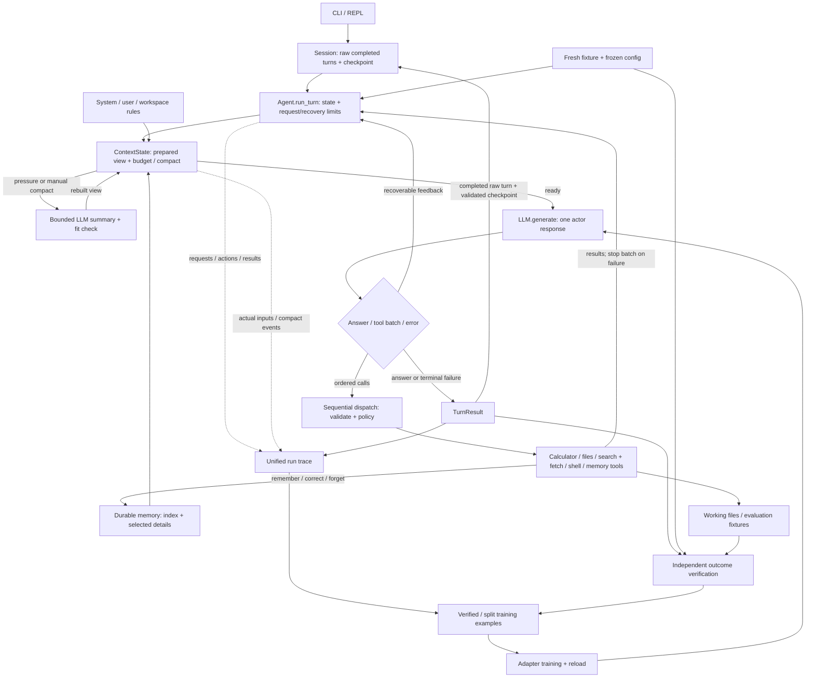

# Build a tiny agent: a two-week sprint

Updated September 21, 2026. Sprint: **September 13–26**; earlier experiments are carried-in work.
This is the implementation scope. [REPORT_ANALYSIS.md](REPORT_ANALYSIS.md) retains the broader learning rationale.

## The finished project

Build a tiny Python agent to learn, through incremental development, how agent loops,
state/result tracing, error recovery, context compaction, and memory change its behavior.
The deliverable has two parts:

- **A working local agent:** sustained CLI conversations, completed-turn session replay,
  local file reads/edits/writes and execution of local scripts, sequential dependent
  tool calls, traceable actions/results, and bounded recovery from common errors.
  Long conversations can compact and continue; explicitly saved knowledge can survive a new session.
- **A post-training experiment:** adapt a trainable base checkpoint with an actual weight
  update, reload it, and use a reproducible benchmark to test whether agent capability improves.
  Aim for gains in completion, recovery, and stopping; report failures and regressions honestly.
  Better prompts or memory alone do not count as post-training.

Use disposable text/JSON workspaces as a small test environment. A representative demo:
inspect files → update a requested value → run a local script/check → use its feedback →
report the observed result → continue the conversation after compaction/restart.
This demonstrates mechanisms; it does not require a general assistant or a vertical-domain product.

**Outside this sprint:** a production coding workflow with edit review/revert guarantees;
local/WeChat/cloud deployment; streaming; asynchronous or concurrent calls; third-party
skills/MCP integration; multi-agent collaboration; background jobs. Stages 4C and 5–7
remain optional future learning branches. Basic synchronous web fetch belongs to Stage 2.

Protect time for both runtime and training: target the small Stages 2–4 core first,
then benchmark/data/training in the second week. These are planning checkpoints, not
completion claims. If work overruns, reduce mechanism breadth and label smaller experiments
as pilots; mark missing required outcomes incomplete instead of silently extending the sprint.

### Implementation order and concrete outputs

| Order | Stage / status | Concrete output |
|---|---|---|
| Carried in | **0.5 — complete** | One user request → model/tool/result loop, validated contracts and error feedback |
| Completed | **1 — complete** | Multiple user turns, persisted Session history, structured per-turn state and traces |
| Completed | **2 — implementation complete** | General filesystem/shell/search/fetch; restricted 2B baseline 8/17 → 12/17 |
| Completed | **3 — implementation complete** | Context budgeting, automatic/manual compact, rule reload at the boundary, versioned checkpoints and restart replay; real-model evidence for 3B items 2-4 and 3C still outstanding |
| Next | **4A–4B — required** | Bounded durable memory, search/read, correction/forget, fresh-session recall |
| Before training | **8 — required** | Resettable benchmark, isolated splits, measured baseline, frozen harness |
| Research | **9 — draft, required outcome** | 3–4B HF checkpoint on vLLM → verified trajectories → QLoRA SFT/reload → base/adapter comparison |
| Later experiment | **10 — draft, conditional** | 2–3 rounds of expert iteration (weak-RSI question); GRPO pilot only if justified |
| Delivery | **11 — draft, required outcome** | Held-out paired results and reproducible demo; dev-only recipe search optional |
| Future branches | **4C / 5 / 6 / 7 — optional** | Dream / skills and MCP / jobs / child agent and planning |

Numbering follows the scratch notes: old Stage 1.1 is now Stage 1; old 1.2 tools move
into Stage 2, alongside its original behavioral evaluation. The original Stage 2 session
plumbing is already complete in Stage 1. Historical evidence filenames keep their old numbers.

### Coding rules for me and AI

- Use ordinary functions/dataclasses and the standard library where practical.
- Implement and explain the loop, context, tracing, tool boundaries, memory, recovery,
  and training-data logic myself. Use AI for review, fixtures, boilerplate, and debugging.
- Accept ordered tool-call batches; execute sequentially, stop the batch on failure, and
  wait for observations before choosing result-dependent arguments. Keep the binary calculator.
  Add modules only when needed; no framework rewrite, event bus, provider catalogue, or UI project.
- Aim for roughly 1,500–2,000 runtime lines; review scope around 2,500. Count tests and
  eval/training separately. This is a design alarm, not a reason to compress readable code.
- Each stage leaves a small demo, a deliberate failure, and evidence of what changed.
  Use focused tests for state and side effects, real-model runs for capability; keep those claims separate.

### Core code size audit

Audit date: September 17, 2026. Count committed **core Python only**: top-level runtime
modules and `tools/`, including the real `agent.py` REPL entry point, argument validation,
response parsing, tracing and session persistence. Exclude `prompts/`, tests, evals,
verification modules, examples, docs, dependencies, generated outputs and untracked stubs.
Non-agent `__main__` demo blocks are also excluded (currently the demo in `llm.py`).
The unused, untracked `memory.py` placeholder is not part of Stage 3A.

**Code lines** are physical lines containing Python syntax tokens, excluding blank lines,
comments and docstrings; multiline literals used by runtime count as code. **Physical lines**
include blanks/comments/docstrings in the same selected source, but exclude demo blocks.
File counts below exclude empty package initializers. These are size measures, not a measure
of capability or quality. The earlier 1,500–2,000 / 2,500 scope alarm refers to physical lines;
do not switch it to the smaller code-only number to hide growth.

Only snapshots with an explicit stage-completion marker are used below. `ebd249d` says
“Complete Stage 2” in its commit subject. `24f2608` and `b3dfab0` contain a `STAGE.md` marking
Stage 2 implementation complete, with the latter labeled “before stage 3” in its subject.
Stage 0.5 (`e282138`) and old Stage 1.1 (`e248ca2`, now Stage 1) have named baseline commits,
but no separate, unambiguous completion marker under today's scope: the former still records
an unresolved parser test and the latter says “initial session management.” Both are explicitly
marked complete retrospectively by `ebd249d`, whose source already includes Stage 2. Do not
invent separate completion counts from that combined tree or treat intermediate baselines
as completed stages. Intermediate experiments and stash commits are excluded.

| Completed checkpoint | Git reference | Nonempty core files | Code lines | Physical lines | Code change from previous row |
|---|---|---:|---:|---:|---:|
| Stage 2, initial restricted tools + behavioral evaluation | `ebd249d` | 11 | 1,285 | 1,515 | — |
| Stage 2, general tools + narrated batches | `24f2608` | 12 | 1,747 | 2,039 | +462 |
| Stage 2 handoff, structural refactor before Stage 3 | `b3dfab0` | 13 | 1,759 | 2,073 | +12 |
| Stage 3A complete: context, instructions, measurement, fit gate | Commit containing this audit: `Complete Stage 3A context budgeting` | 14 | **1,940** | **2,296** | **+181 (+10.3%)** |
| Stage 3 complete: compaction, rule reload, checkpoints, restart replay | Commit containing this audit | 15 | **2,254** | **2,800** | **+314 (+16.2%)** |

Stage 3B item 1 and the September 20 refactor brought the tree to 2,584 physical lines at
`d7f3887`; Stage 3B items 2-4 and Stage 3C added **216 more (+8.4%)**, reaching 2,800 physical
/ 2,254 code. Source fingerprint
`ece7ac5b6790923d05f59bb3c553cfe00e3fa99eca695b1a0ef7a312de8e8e4f`. That is nearly double the
roughly 120 lines the work was estimated at; the excess is Google-style docstrings on the new
public surface rather than new branching. The 2,500-line alarm was answered by the
design-boundary review in [context-memory.md](context-memory.md#design-boundary-review-2584-physical-lines),
which revised the alarm to **3,000 physical lines** and split no modules.

Stage 3A added **223 physical lines (+10.8%)** over its direct parent. Its code growth is:

| Core file | Before 3A | After 3A | Code-line increase |
|---|---:|---:|---:|
| `context.py` | 0 | 96 | +96 |
| `agent.py` | 242 | 298 | +56 |
| `llm.py` | 223 | 248 | +25 |
| `trace.py` | 73 | 76 | +3 |
| `config.py` | 22 | 23 | +1 |
| Other core modules | 1,199 | 1,199 | 0 |

Tools account for **1,019 / 1,940 code lines (52.5%)**; the loop/model/context/session and
support modules account for the other 921. The largest earlier jump was general tools and
batches, not context management. At 2,296 physical lines we are above the original target and
204 lines below the scope-review alarm. Before Stage 3B grows, review the design boundary;
do not compress readable code merely to stay under it.

Reproduce from the repository root with the dependency-free audit utility
[`evals/core_lines.py`](../evals/core_lines.py), which is itself excluded from the count:

```sh
python -m agent_from_scratch.evals.core_lines ebd249d 24f2608 b3dfab0 HEAD
# Before a future completion commit, audit exactly the staged source:
python -m agent_from_scratch.evals.core_lines INDEX
```

Use `--git /Library/Developer/CommandLineTools/usr/bin/git` on this Mac if the normal Git
launcher is unavailable. Output includes per-file counts and a SHA-256 of sorted source
paths/contents. Stage 3A source fingerprint:
`70e426cf585e43211a32cb4ffe7ce95702a194092942b6f08ef152a02f07ba0f`.
At each explicitly completed stage, append one row using its committed snapshot; preserve
older rows, replace this row's self-reference with its hash, and explain any scope-rule change.
Review newly added root/tool modules for verification-only or demo code before counting them.

## Stage 0.5 — one request with an agent loop · complete

- [x] Local Qwen/llama.cpp inference, response parsing, tool dispatch, and calculator.
  One user request can contain several model → tool → observation iterations before a final answer.
- [x] Validate response structure and tool arguments before execution; return parse/tool
  errors to the model as feedback, with a bounded request count.
- [x] Extract native/Qwen call batches with surrounding narration; preserve quoted examples
  as text. Validate all call JSON/shapes before execution; cap at 8 calls/response and 40 attempts/turn.
- [x] Trace each call/result, including skipped calls after failure, interruption or budget
  exhaustion. The later batch support supersedes the historical single-call notes below.
- [x] Show complete assistant progress messages in the REPL before the associated calls;
  keep model generation non-streaming.
- [x] Model the scratch-note concepts with the current `LLMResponse`, `ResponseError`,
  `ToolResult`/`ToolErrorCode`, and `TurnResult`; no renaming to `ResponseResult`/`ToolError` is required.

**Capability gained:** tool use within one request. Cross-request conversation belongs to Stage 1.
Evidence: [baseline notes](day01_stage0.5.md).

### My Takeaways (AI is NOT ALLOWED to edit)

- Load only the required quantized files, for example
  `hf download Qwen/Qwen2.5-7B-Instruct-GGUF --include "qwen2.5-7b-instruct-q4_k_m-*.gguf"`.
  The previous note recorded roughly 4.68 GB; treat that as a historical observation.
- Model loading, reuse of a loaded model, and prefix/KV-cache reuse are different.
  A `prefix-match hit` log concerns inference reuse, not cross-turn conversation
  memory. `verbose=False` is already present for llama.cpp logging.
- SOLVE ONE PROBLEM AT A TIME, FIND THE GAP IS THE KEY. Predict where messages append and why a
  loop exits before adding another mechanism.
- A **tool** is callable code with an argument/result contract. A **skill** is
  reusable instructions plus optional resources/scripts; it can guide several
  tools, but is not itself necessarily executable code. Stage 5 implements discovery
  summaries and loading separately from dispatch.
- Keep Qwen parsing a compatibility fallback; do not detect calls from a loose
  substring, fabricate a tool result for an unparsed call, or add JSON repair machinery.
- A list of tool calls, an arithmetic-expression tool, and concurrent tool execution
  remain optional later comparisons. If an expression tool is ever added, use a
  restricted arithmetic parser, never unrestricted `eval`.

### My Scratch Notes (AI is NOT ALLOWED to edit)
1. Stage 0.5: one-turn with llm calling and basic tool calling enabled, e.g. single user_input -> llm.generate() -> tool call -> result per turn. Guard with tool schema validation, reponse validation and parsing, error capture and ingested back to model. You should has some data modelling designed for `ToolResult`, `ToolError`, `ResponseResult`, `ResponseError` and `TurnResult`.
2. Stage 1: 
- From one-turn to multi-turn interactions. This is where the `Session` is first developed and conversation is preserved for history. Record such as messages, state (stop_reason, error etc.) should be stored in a strucuted way per turn. 

## Stage 1 — multi-turn sessions and observable execution · complete

Read: book Chapters 1 and 3; Appendix A.1/A.5/A.8. Nanobot: [runner][nb-loop] and
[session history][nb-session] separate the execution lifecycle from conversation replay.
Our `SessionStore` keeps that distinction without Nanobot's channels, hooks, or streaming.

- [x] Preserve conversation across user turns; support `/new`, `/reset`, `/session <id>`.
  `run_turn` receives history explicitly; the REPL loads completed turns from disk.
- [x] Keep structured **session → run → model request/tool result** records: IDs,
  ordered messages, raw responses, errors, stop reason, settings, elapsed time, and available usage.
  Call IDs join requests to results. Run schema is v3; session schema is v1, with legacy readers.
- [x] Distinguish `final_response`, `max_iterations`, `tool_limit`, `no_progress`, `model_error`,
  and `interrupted`. Parser/tool failures get targeted feedback; three identical consecutive
  failures stop the loop. Backend errors stop cleanly; Ctrl-C retains available run evidence.
- [x] Replay only completed turns. Failed/interrupted runs remain trace evidence;
  independent trace/session write failures do not erase previously saved state.

**Completion boundary:** Stage 1 is complete for this rescope; context management remains
Stage 3. Persistence is single-writer and saved at turn end, without exact mid-turn crash resume.
The [foundation checkpoint](../evals/FOUNDATION_CHECKPOINT.md) records 82 deterministic tests
and real-model smoke results; those are historical evidence, not tests rerun by this document edit.
A terminal answer still does not prove task success; premature stopping is an observed model gap.

## Stage 2 — file, web, shell tools and the first behavioral baseline · implemented

Read: book Chapters 1/3/4; Appendix A.1/A.3/A.5/A.8. Keep the lifecycle explicit:
**parse → registry/schema validation → execution policy → execute → result/error → next iteration**.
Prompt rules describe expected behavior; runtime enforces paths, allowed operations, and budgets.

### 2A — finish the small tool set · implemented

- [x] Inject a registry per agent; schemas reflect that registry. `tools/files.py` provides
  recursive/paginated `list_files`, line-numbered `read_file`, full/append `write_file`, and
  targeted `edit_file`. Support general local paths, optional confinement, continuation,
  atomic replacement, mode preservation and optional version checks. Read PDF/Office text
  through `file_documents.py`; images expose metadata only. Frozen evaluations retain the
  original confined byte-based tools in `evals/legacy_files.py`.
- [x] **`tools/web.py`:** synchronous general HTTP/HTTPS `web_fetch(url, extract_mode?)`
  with compressed responses and main-content or navigation-inclusive HTML text extraction,
  plus `web_search(query, count?)` via `ddgs`. Both return source URLs and retrieval time;
  fetch also reports HTTP status and truncation. Bound time/content and fetch redirects.
  Extraction does not render CSS or JavaScript. Pages/snippets are untrusted evidence.
  An optional host list supports restricted fixtures. Browsers/login remain out of scope.
- [x] **`tools/shell.py`:** synchronous `shell(command, working_dir?)` runs ordinary local
  commands, scripts, pipes and redirects. Return exit code, capped stdout/stderr and
  timeout/interruption status; clean up foreground process groups on timeout/Ctrl-C.
  Keep optional fixed `command_id` mode for the original benchmark and fixture demo.
  General shell uses local user permissions; cwd/file-tool bounds do not sandbox it.
- [x] Make denials and failures visible through `ToolResult` and the same run trace.
  On interruption, record a pending call as interrupted/unknown if no result exists;
  never imply it succeeded or automatically replay its side effects. Keep the REPL usable.

Evidence: [tools checkpoint](../evals/TOOLS_CHECKPOINT.md). The initial restricted 2A
implementation had 102 tests; the general-tool follow-up has separate mechanism/live checks.
The fixed 2B suite below remains the historical behavioral baseline.

**Nanobot comparison:** [registry][nb-registry] validates and feeds errors back;
[filesystem][nb-files] separates read/write path resolution; [shell][nb-shell] implements
process cleanup and output limits; [web][nb-web] records extraction/redirect/truncation data.
The September 15 follow-up adopts Nanobot's filesystem, general shell and search/readability approach,
using its underlying libraries with our synchronous `ToolResult`/trace contract.
No async runtime, provider catalogue or interactive approval engine is added.

### 2B — first behavioral baseline · complete

- [x] `evals/run.py` + `verify.py` reuse foundation read-coverage checks. **17 dev tasks**
  cover dependent inspection, constrained changes, matched recovery, stopping and calculator.
  Rows specify prompt, fixture, tools, budget, verifier, evidence/constraints and split.
- [x] Allocate skeletons before variants; use fresh temporary files and session state per run.
  Fixed Python verifiers inspect artifacts and actual source reads after the ordinary loop ends.
  Recorded web results isolate behavior from network changes; 2A retains live-fetch evidence.
- [x] Save task outcomes, call/error counts, paired recovery, reviewed false completion,
  unintended writes, requests/usage/latency, settings and code/fixture hashes. Missing usage
  stays unknown. Train/test skeletons are reserved; their task sets are not yet generated.

**Evidence:** [2B checkpoint](../evals/BEHAVIOR_CHECKPOINT.md), **118 tests**, 17/17 scripted
solutions; prompt ablations improve **8/17 → 12/17 strict passes**, retaining all original passes.
The full prompt fixes no-op behavior; nested edits, web JSON/recovery and two answer formats
still fail. Two false claims and one unintended-write task remain. The selected prompt trades
fewer side effects than shorter candidates for higher generation cost: 78 → 270 seconds.
Bad arguments/blocked commands and follow-up/reload/reset have scripted regression coverage;
real dev tasks exercise path denial, fetch failure and timeout. Fake “done” artifacts fail.
Implementation/baseline are complete; reliable autonomous completion remains a measured goal.

**September 16 handoff review:** all **167 deterministic tests pass** in
`transformer-practice` (`python -m unittest discover -s agent_from_scratch/tests -v`).
The **8/17 → 12/17** results above are historical restricted-tool development runs,
predating the general tools, narrated-call parser, batches and later prompt/template changes.
Saved results were checked; no fresh real-model benchmark was run for this review.
Stage 2 is complete at that implementation/baseline boundary, and Stage 3 can begin.
The original handoff count was **2,083 physical Python lines / 15 files** (including two empty
package files). The core-only audit above excludes the 10-line embedded `llm.py` demo,
yielding **2,073 physical lines / 1,759 code lines / 13 nonempty files** at `b3dfab0`.

## Stage 3 — context construction and compaction · required

Read: book Chapters 2/3/5; Appendix A.1/A.2/A.4/A.5. Nanobot:
[context assembly][nb-context], [accepted history versus unsent delta][nb-governance],
and [summary checkpoint][nb-summary]. Apply the mechanisms to our measured window;
the book's token constants and vendor-specific recovery paths are not our configuration.
Design decisions: [tool-result semantics and state ownership](CONTEXT_STATE_DESIGN.md).
Stage 3 is implemented. Each generation receives an independent prepared view whose
prompt tokens and remaining room are checked before generation; compaction is automatic or
manual through one bounded path; and a versioned summary checkpoint lets a restarted session
replay a summary plus its uncovered raw suffix. The REPL gained `/compact` and loads a
checkpoint per turn; other new CLI commands stay deferred, and a future `/status` may expose
usage, reported cache data, session ID and context statistics. Deterministic coverage is
complete; **no local-model diagnostic was run for 3B items 2-4 or 3C** because the September
20 host could not hold the 7B weights. See [context-memory.md](context-memory.md).

### 3A — one prompt path and a visible budget

- [x] Add `context.py`: one builder used **before every generation**, including after tools
  and parser feedback. Explicit instruction/history/current-turn inputs are deep-copied
  into the model-facing view; raw messages retain all exchanges for traces, sessions and
  evaluation. Durable memory and summaries remain future inputs when those features exist.
  Validation: **170 deterministic tests pass**, including deep-copy isolation and fresh
  inputs after parser feedback/tool results, with trace/session replay preserved.
- [x] Organize `prompts/system.md` into purpose, behavior, tools, and reporting rules.
  Load only an explicitly configured user instruction file and workspace-root `AGENTS.md`.
  Use a documented order (system → user rules → workspace rules), source hashes, and caps;
  preserve the runtime contract, and give current user corrections priority over saved preferences.
  Source order aids inspection; it does not itself enforce model compliance. `context.py`
  loads once per turn; compact-boundary reloading waits for Stage 3B. No ancestor crawling
  or imports; the prompt prohibits autonomous rule edits. Defaults are 8 KiB/source and
  16 KiB assembled, with visible setup errors instead of silent omission/truncation.
  **178 deterministic tests pass**; source metadata lives in the existing run settings.
  Implementation guide: [Stage 3A item 2 plan](STAGE3A_ITEM2_PLAN.md).
- [x] Count the actual formatted prompt, including schemas/role markers, with the generation
  formatter and tokenizer. Record total prompt tokens, effective backend window, configured
  response reserve and remaining room in request traces; no new CLI command. Custom or
  replaced handlers are explicitly unavailable, with null counts rather than an estimate.
  Detailed component breakdowns and a future `/status` can follow when useful. Stale usage
  and KV-cache hits do not measure the next changed prompt or enlarge the context window.
  **183 deterministic tests pass**. Five local Qwen requests matched reported prompt usage
  exactly; a 12,030-token measurement exposed negative room without attempting generation.
  Evidence and limits: [context measurement](CONTEXT_STATE_DESIGN.md#implemented-next-request-token-measurement).
- [x] Require `prompt + response reserve + margin <= window` before every generation.
  The initial fit check stops with `context_limit`, including when exact measurement or
  a bounded reserve is unavailable. Default margin: 256 tokens. Blocked requests retain
  their budget in the trace but do not count as model calls; completed tool effects/results
  remain intact. No silent truncation of the request, rules, or claimed file coverage.
  **191 deterministic tests pass**. Local Qwen diagnostics compared 2,048/4,096-token
  windows and 256/16,000-character read caps: small output continued, large output blocked
  the next generation, and oversized initial input made zero model calls.
  Evidence: [fit enforcement](CONTEXT_STATE_DESIGN.md#implemented-request-fit-enforcement).
  Stage 3B will add early compaction with bounded tool-exchange headroom and separate
  summarizer input/output budgets; the current margin cannot guarantee arbitrary results fit.

### 3B — compact and continue the same task

- [x] Implement automatic compact and a callable manual compact path sharing one
  implementation and `prompts/compact.md`. Summarize goal, constraints, observed progress,
  errors/corrections, and next steps; keep instructions, current request, recent complete
  tool pairs, and every observation not yet sent to the actor. Track that last-sent boundary
  separately. `Compactor.attempt()` in `compact.py` is shared by automatic recovery and
  `run_turn(..., compact=True)`; it returns `CompactOutcome` so the loop can distinguish a
  spent failed attempt from a free refusal without inspecting compaction state.
  Retain two recent tool batches and the unsent raw suffix; one bounded summary call per
  attempt, at most four per run, charged to the existing request limit. Publish only a
  smaller fitting view; raw evidence/session deltas stay unchanged. **204 deterministic
  tests pass**. Real-model retained/lost facts and scope limits: [compact evidence](context-memory.md).
  The REPL now reaches the manual path as `/compact`, which marks the next request rather
  than acting alone: compaction runs inside a turn against that turn's own view, so there is
  no earlier point at which it can take effect. It is deliberately a user command and not a
  model-facing tool, which would run one request too late to relieve the pressure it answers.
  Trace records renamed `ModelRequest.context` to `budget` at `schema_version` 5; records at
  4 and earlier carry the old key, which matters for the 3C eval-export item below.
  September 18 core after the compaction refactor: **2,582 physical / 2,139 code lines**
  across 15 nonempty core files (+109 physical / +45 code over `eef064a`), excluding the
  untracked memory stub. Source fingerprint
  `0dd3018c110c6c0eceb893b3b8622ecef5745fa114a7b5056818f0359936a40c`.
  This is a partial item, not a stage-completion audit.
  **This crosses the 2,500-line design alarm by 82 physical lines.** The design-boundary
  review that the audit section requires is therefore due before 3B grows further; do not
  compress readable code merely to return under the line.
  Review fixes resolved TypedDict access and test-fixture typing; 42 Python files pass
  Pyright with zero errors/warnings. An earlier class refactor was reverted; the present one
  landed as twelve reviewed commits, `9802c90`..`b060096`.
- [x] Compact old turns first, then older complete exchanges within a long ongoing turn.
  Never split a call/result pair. Rebuild the prompt with summary + retained suffix + fresh
  observations, reload stable rules and bounded memory, then recheck fit before publishing it.
  Ordering, pair safety and the pre-publish recheck came with item 1. This item adds the rule
  reload 3A deferred: `ContextState.instructions` overrides `raw[0]` in the model-facing view
  from a compact boundary onward, and `Compactor._publish` measures the candidate with the
  rules it would carry. Raw evidence never changes; `ModelRequest.input_messages` records what
  each request actually sent. A failed reload keeps the turn snapshot and is recorded rather
  than ending a turn already under pressure. Rules that grow more than the summary shrinks
  correctly refuse the swap. Bounded memory attaches at the same point in Stage 4A and is
  **not** implemented here.
- [x] Keep run ID, iteration/failure counters, registry, and actual workspace state intact.
  Do not replay tools or treat summarized file state as current without rereading when needed.
  For truncated model output, reuse bounded correction feedback; never execute a partial call.
  No production change was required: `Compactor` touches four `ContextState` fields and nothing
  else, and `run_id`, `tool_attempts`, `failure_count`, `used_ids` and the registry are
  `_run_turn` locals beyond its reach. Four regressions make this checkable at the pressure
  points the gate names. Rereading summarized file state is instructed by `prompts/compact.md`,
  which is a prompt, not an enforced guarantee.
- [x] Bound recovery: at most two summary calls per attempt, four per run, and one attempt
  at an unchanged boundary. Count summary requests in total cost/request limits. A failed or
  still-oversized candidate preserves raw evidence and the prior checkpoint, then stops with
  `context_limit`; repeated compaction cannot reset the task budget.
  `Compactor.attempt` is a bounded loop of `max_summary_calls_per_attempt` (2) calls over one
  cut; the retry carries why the previous call was rejected, and a blocked summarizer input
  breaks out at once because a retry cannot make its own input fit. The per-run ceiling and the
  `max_iterations` reserve for the actor are rechecked between calls. `summary_max_tokens` (512)
  gives the summarizer an output reserve separate from the actor's, via an optional per-request
  `max_tokens` on `LLM.measure_context`/`generate`. Separately,
  `AgentLimits.max_tool_calls_per_response` is now the limit the parser enforces rather than a
  recorded value it ignored. **228 deterministic tests pass**; 0 Pyright errors/warnings.

### 3C — persist and inspect the continuation

- [x] Save a versioned summary checkpoint with stable raw boundary, source digest, and
  summary configuration. Persist raw new-turn messages before publishing a checkpoint
  referencing them. Save an explicit raw turn delta, not a slice of compacted messages.
  `SessionStore` gained a `schema_version` 2 `checkpoint` record in the same session file,
  validated separately and skipped by `load_history`. `covered` counts session messages, one
  less than `ContextState.covered`, whose raw index 0 is the system message. `_save_session`
  appends the raw delta first and the checkpoint second, as two separately atomic writes;
  `append_checkpoint` refuses any boundary the session does not already hold, which enforces
  the ordering and also makes library-supplied history safe. A checkpoint write failure leaves
  the saved turn intact and is logged.
- [x] Replay summary + uncovered raw suffix on restart. Invalid/stale checkpoints fall back
  to raw history and its budget check; `/reset` also clears the session checkpoint.
  Incomplete turns stay evidence only; exact mid-tool resume remains outside scope.
  `run_turn(..., checkpoint=...)` seeds `covered`/`summary` while `history` stays the full raw
  list, so session slicing and raw evidence are unchanged. `load_checkpoint` considers only the
  newest record and returns None on any digest mismatch. Checkpoints live in the session file,
  so `/reset` clears them with it. Only completed turns publish one.
- [x] Extend the existing trace with actual model-facing inputs, purpose (`agent`/`compact`),
  boundaries, usage, and before/after sizes. Preserve old readers and update eval export.
  This is also the input record needed later for truthful training examples.
  Those fields landed with item 1 at schema 5; this item adds the readers. `schema_version`
  stays 5 because `ModelRequest.instructions` is additive, matching the precedent set when
  `budget` was added at schema 3. `trace.request_budget()` reads the measurement from records
  on either side of the schema-5 rename. `metrics()` and `measure()` report `actor_requests`,
  `compact_requests`, `compactions_applied` and `max_actor_prompt_tokens`; every pre-existing
  key keeps its meaning, so the frozen Stage 2B suite still reads.

**Gate/output:** a multi-turn conversation and a long single turn compact twice and continue
without losing the current request/correction, duplicating a write, or resetting limits.
Test pressure immediately after a tool result/parser error, a failing summarizer, checkpoint
write failure, and restart. Keep prompt-size measurements and real-model retained/lost facts
in `docs/context-memory.md`; compare full history versus compact on tasks fitting both.

## Stage 4 — durable memory · 4A–4B required

Read: book Chapters 2/5; Appendix A.4/A.8. [Nanobot memory][nb-memory] separates an archive
journal from durable facts, with [Dream-managed memory rules][nb-memory-skill]. Its builder
loads full `MEMORY.md`; our short index and explicit update tools below are intentional adaptations.

### 4A — bounded index and on-demand detail

- [ ] Add `memory.py` with one project-scoped canonical `memory/state.json`: stable key,
  title, detail, kind, source references, updated time. Single writer, atomic replacement.
  Render `MEMORY.md` as a derived short index; never preload the whole store.
- [ ] Register `memory_remember`, `memory_search`, `memory_read`, `memory_forget` through
  the existing tool contract. Use keyword search and bounded results; update by stable key.
  Cap entry size/count, index tokens, and reads. Omitted index entries remain searchable;
  show omissions/capacity errors instead of silently evicting facts.
- [ ] Store memory outside resettable task fixtures with explicit workspace identity.
  `/new` and `/reset` preserve durable memory; forgetting is explicit. `/memory` inspects
  scope and size. Memory tools must reject another workspace's identity. The current
  general file/shell tools are unrestricted; stronger isolation requires an explicitly
  confined tool configuration and cannot be promised by the memory store alone.

### 4B — provenance, corrections, and recall

- [ ] Save stable preferences, explicit feedback, and useful references; keep current task
  progress in the session summary. Sources identify user statements, observations, or inferences;
  the host attaches valid current source IDs or validates supplied IDs. Origin is not proof of truth.
- [ ] Trace corrections/forgetting; current user instructions override stored preferences.
  Retrieve relevant details through normal tools, tracing selected keys/hashes. Reattach only
  bounded relevant memory after compact; no background note writer or rule-file rewriting.
- [ ] Add bounded `memory_search(scope="session")` over the current session's retained raw
  evidence to recover a detail omitted by compact. Return source IDs/excerpts and a partial-search
  notice at the scan cap. No cross-project/session scan or automatic promotion into durable facts.

**Gate/output:** session A saves a preference, B corrects it, and clean session C recalls the
correction. Check forget, capped-index retrieval, workspace isolation, invalid provenance,
interrupted writes, and recovery of an omitted session detail. Compare memory off/on from the
same starting facts; save misses as well as successes in `docs/context-memory.md`.
Memory changes context, not model weights. No embeddings, memory graph, or automatic profiling.

### 4C — archive and Dream · optional, outside the sprint

Close a session into a bounded archive; `/dream` processes only new records and proposes
validated facts/corrections. Commit memory changes and processed cursor together; malformed
output preserves the cursor, and a second run without new records does nothing. Keep archive,
compact, and Dream boundaries separate. No shell, skill rewriting, or background job dependency;
direct memory updates work without Dream. Disable Dream in the primary training comparison.

## Stage 5 — skills and one MCP integration · optional, outside the sprint

Keep catalog → selected skill body loading, three small memory/web/shell instruction skills,
one attributed vendored skill, and one allowlisted local stdio MCP tool through the registry.
Reuse Stage 2 web fetch; do not rebuild it here. Bound instruction text, validate supported schemas,
keep SDK async details inside the adapter, and close server/process resources on errors.
**Gate:** unloaded bodies are absent; skill-guided use and a real MCP transport call appear in
ordinary traces; unknown tools, dead servers, and timeouts fail cleanly. Nanobot: [skills][nb-skills].

## Stage 6 — background work and recurring jobs · optional, outside the sprint

Keep SQLite job state, `tick(now)`, one sequential worker, occurrence IDs, status/result/cancel,
and restart handling. Jobs get isolated fixtures/sessions; serialize model and memory access.
Pending cancellation prevents execution; running work stops at supported boundaries and cleans
up owned processes. Mark interrupted occurrences, avoid duplicate ticks/backlog bursts, and never
replay uncertain side effects automatically. **Gate:** fake-clock one-shot/recurrence/cancel and
restart demos. No daemon/distributed scheduler. Nanobot reference: [cron service][nb-jobs].

## Stage 7 — one child agent and explicit planning · optional, outside the sprint

Keep synchronous `delegate(task)` using the same loop, fresh context, read-only tools, depth one,
four child steps, and at most two delegations. Link child/parent traces and charge shared budgets;
parent owns synthesis and the final answer. Compare direct vs inspect/edit/check plan, then
parent-only vs child-assisted runs separately on the same six dev tasks. **Gate:** useful evidence
returns; prohibited writes/recursive delegation never execute; exhaustion is visible. No teams or
concurrent writes. Nanobot reference: [restricted subagent][nb-child]; this design stays synchronous.

## Stage 8 — benchmark and harness freeze · required

Build on Stage 2 after Stages 3–4A/B. The local workspace is a learning benchmark, not a domain product.

- [ ] Cover inspection/reporting, constrained updates, recovery/verification, and appropriate
  stopping with roughly 2–6 dependent tool interactions. Vary layout, distractors, values,
  dependency chains, and fault positions; allow multiple valid solutions.
- [ ] Keep train, dev, and final test isolated by task skeleton before creating variants;
  reset workspace/session/memory per task. Start from the 12–20 dev cases; target 50–100 reserved
  final cases if affordable, explicitly labelling smaller samples as pilots. A public benchmark
  subset is optional; identify adaptations and never present a local score as its official score.
- [ ] Verify final artifacts/constraints independently. Report counts/denominators, false
  completion, invalid calls, matched-fault recovery, stopping, tokens, requests, latency, and cost.
  Keep long-session/compact/restart and delayed-memory recall in separate harness evaluations.
- [ ] Compare full history/compact on fitting tasks and memory off/on from identical facts.
  Freeze code, prompts, tools, checkpoint/template, decoding, budgets, compact policy, memory
  snapshot/policy, task splits, and verifiers before comparing weights.
- [ ] Run the intended trainable checkpoint as the base control. Primary weight comparisons
  use short tasks and disabled or identical read-only memory; no cross-task accumulation or
  evaluator coaching. For long-context comparisons, hold the summarizer checkpoint/config fixed.

**Gate/output:** scripted valid solutions pass and fake “done” outputs fail; real-model baseline
includes interpretable failures. Save task-level results and a frozen manifest in `docs/benchmark.md`.
Fix protocol/evaluator bugs before training; do not require the base model to solve every task.

### Post-training plan for Stages 9–11 (decided September 21)

**Trainable model:** a 3–4B instruct checkpoint in HF safetensors, first candidate
[Qwen3-4B-Instruct-2507](https://huggingface.co/Qwen/Qwen3-4B-Instruct-2507). The Qwen2.5-7B GGUF
stays the Stage 2–4 engineering model, not the training control. A smaller model fails more often,
leaving headroom and pass@k variance, and it makes iteration and an RL pilot fit the budget. The
cost is a fresh baseline and a revalidated tool template on the new checkpoint.

**Backend:** GGUF is inference-only, so training uses bf16/QLoRA HF weights. Rollouts and all
weight comparisons run on one rented-GPU vLLM server with LoRA adapters, behind an
OpenAI-compatible `llm.py` backend. The control is **the same checkpoint, backend and precision
with the adapter disabled**. The chat/tool template used to render training examples must be
token-identical to the one used at inference. Merging into a quantized GGUF for local demos is
allowed only after the comparison, and it gets its own spot check.

**Budget:** US$100 in total, including teacher API calls, GPU hours, storage and failed runs.
These are rough allocations to recheck against live prices before renting:

| Item | Assumed scale | Estimate |
|---|---|---:|
| Trajectory data (teacher API + base self-sampling) | 1–2k trajectories × ~4k tokens | $10–25 |
| QLoRA SFT, including one or two reruns | 2–8M tokens, 1–3 epochs, one 24–48 GB GPU | $5–15 |
| Evaluation (base/adapter/rounds × 3 seeds) | 1–3 GPU-hours on vLLM | $3–10 |
| Expert-iteration rounds (Stage 10) | 2–3 × (sampling + SFT) | $15–30 |
| GRPO pilot (Stage 10, conditional) | a few GPU-hours | $0–30 |
| Reserve: idle time, debugging, failures | ~25% | ~$20 |

Every rental session has an hour cap and ends with the pod stopped. Spend is recorded in each
experiment's ledger row.

**Data:** the environment is the dataset. Train examples come from procedurally generated variants
of **train skeletons** (layout, distractors, values, dependency length, injected fault position).
Skeletons are split before variants are created, so no test skeleton shapes training. Public
function-calling data (for example `Salesforce/xlam-function-calling-60k`, APIGen-MT,
`NousResearch/hermes-function-calling-v1`, `THUDM/AgentInstruct`) is at most a ~20% regularizing
mix, and only after each license is checked. Its single-call distribution differs from our
multi-step file/shell tasks.

**Evaluation layers:**
1. Primary: 50–100 new reserved test skeletons, never used for prompt or recipe tuning. The
   Stage 2B dev tasks already influenced prompt choices and do not qualify.
2. Optional external reference: a locally adapted BFCL multi-turn subset, labeled as a local
   adaptation and never reported as an official score.
3. Regression: a small IFEval/general-QA subset to catch damage outside tool use.

Paired comparisons use [`evals/trajectory.py`](../evals/trajectory.py) (exact McNemar over
task IDs).

**Terminology:** STaR/ReST-style expert iteration and self-generated data are *self-improvement*.
RSI in the strict sense means the system also gets better at producing the next improvement, and a
rising score alone does not show that. Automated recipe search is *automated research*. Karpathy's
autoresearch belongs to this last category and is not RSI: a fixed agent edits another small
model's training code, keeps or reverts each change against a fixed metric, and never improves
itself. Its protocol is what we adopt: fixed evaluator, limited change surface, time-boxed runs,
keep/revert, and a full ledger. Harness self-modification (STOP, Gödel Agent, Darwin Gödel
Machine) is out of scope: a 3–4B actor cannot do it, so a teacher API would do the real work and
the attribution would be muddled.

## Stage 9 — verified trajectories and adapter SFT · draft

**Required outcome.** It depends on the Stage 8 freeze, re-measured on the new checkpoint.

- [ ] Add the OpenAI-compatible vLLM backend. Validate the 3–4B checkpoint's tool template
  against parser/measurement, and re-run the Stage 8 baseline on it (adapter off). Keep the GGUF
  path working for the existing tests and demos.
- [ ] Write the train-skeleton task generator, with fault injection for recovery cases. Reserve
  the test skeletons first.
- [ ] Collect data along two tracks, each recorded with provenance:
  (a) teacher distillation, where a stronger API model runs **inside our harness**;
  (b) rejection-sampling fine-tuning (RFT/STaR), which samples N base rollouts per task.
  Keep only verifier-passed trajectories, then deduplicate. Export from the schema-5 trace
  `input_messages`, so each example is exactly what the model saw.
- [ ] Loss masks cover assistant tokens only; tool observations and runtime feedback are context.
  First run a tiny overfit → save → reload smoke test, then a QLoRA pilot.

**Output:** adapter weights reloaded into the ordinary loop, dataset/config/cost records, and a
dev comparison of base, teacher-SFT and RFT-SFT against the same checkpoint/backend/precision with
the adapter off.

## Stage 10 — expert iteration and outcome learning · draft, conditional

**Primary: 2–3 rounds of expert iteration.** M0 samples → the verifier filters → SFT produces M1
→ **M1 samples** the next data → M2 … Each round keeps the same task pool, sampling budget,
verifier and training recipe. The measured weak-RSI question is:
**is M_k a better data generator than M_{k-1}?** Report per round the verified-trajectory yield,
hard-task coverage, dev pass rate, and whether round k+1's gain is at least round k's. Diminishing
returns, drift, or collapse are valid results. Only verifier-passed data enters training.

**Conditional: a GRPO pilot.** Run it only if tasks show mixed outcomes across samples
(0 < pass@k < 1; all-pass or all-fail groups give zero advantage), the terminal reward survives an
exploit review (fake "done" artifacts, verifier bypasses, reset leaks), and the measured rollout
cost fits the remaining budget. **Output if selected:** reward diagnostics, and only if real
updates were reloaded, a comparison against the best SFT round under the same harness. A reward
lab alone is not an RL-trained model.

## Stage 11 — final comparison and delivery · draft

**Required outcome:** after dev selection, run the frozen base, the chosen SFT adapter and each
expert-iteration round on the reserved test set. Report paired wins/losses, counts, costs,
uncertainty, regressions and limitations. Do not promise gains, and do not treat a local
improvement as broad agent generalization. Package setup, fixture reset/eval, adapter reload, and
a demo covering tools → recovery → compact → restart → corrected memory. Keep `docs/results.md`
and `docs/demo.md`.

**Optional, dev-only: autoresearch-style recipe search.** A coding agent proposes one bounded
change at a time, drawn from data mix, filter threshold, LoRA rank/lr, epochs, and the
teacher/RFT ratio. Each change gets a time/cost cap, a dev evaluation, keep/revert, and a
ledger row that includes failed hypotheses. The agent never sees the test set, and the evaluator,
harness and splits stay frozen. Report it as automated research, not RSI. Missing
runtime/training evidence stays explicitly incomplete.

## Reference map and next step

The book's [Ch. 1][ch1], [Ch. 2][ch2], [Ch. 3][ch3], [Ch. 4][ch4], [Ch. 5][ch5], and
[Appendix A][appendix] supply design questions, not a parity checklist. Apply A.1–A.5/A.8
to Stages 1–4; defer streaming, concurrency, hooks, approval UI, A.6 multi-agent, and A.7 team rollout.
This sprint uses disposable fixtures and explicit outcomes instead of a coding-agent rollback system.

Nanobot links below refer to inspected local source at commit
`0b1fa0c3e44510e3d34d9bed4d491884cb19de7e` (shakewingo fork of HKUDS/nanobot).
Our synchronous loop, optional fixed-command evaluation mode and explicit failure policies
are smaller implementations of selected ideas, not claims of identical behavior.
The capped memory index remains planned Stage 4 work.

**Next coding session:** run `examples/continuation_demo.py` and `examples/compact_demo.py`
on a host that can hold the 7B weights, and record the retained/lost facts in
[context-memory.md](context-memory.md); that is Stage 3's one outstanding gap. Then start
Stage 4A–4B memory, which attaches at the compact boundary beside the reloaded rules.
Complete it before the Stage 8 freeze. For each session record: what I built, what I broke, what the evidence shows,
what I can explain unaided, and the next smallest gap.

[ch1]: ../../../harness-books/book1-claude-code/chapter-01-why-harness-engineering.md
[ch2]: ../../../harness-books/book1-claude-code/chapter-02-prompt-is-control-plane.md
[ch3]: ../../../harness-books/book1-claude-code/chapter-03-query-loop-heartbeat.md
[ch4]: ../../../harness-books/book1-claude-code/chapter-04-tools-permissions-interrupts.md
[ch5]: ../../../harness-books/book1-claude-code/chapter-05-context-memory-compact.md
[appendix]: ../../../harness-books/book1-claude-code/appendix-a-checklists.md
[nb-loop]: ../../../nanobot/nanobot/agent/runner.py
[nb-session]: ../../../nanobot/nanobot/session/manager.py
[nb-registry]: ../../../nanobot/nanobot/agent/tools/registry.py
[nb-files]: ../../../nanobot/nanobot/agent/tools/filesystem.py
[nb-shell]: ../../../nanobot/nanobot/agent/tools/shell.py
[nb-web]: ../../../nanobot/nanobot/agent/tools/web.py
[nb-context]: ../../../nanobot/nanobot/agent/context.py
[nb-governance]: ../../../nanobot/nanobot/agent/context_governance.py
[nb-summary]: ../../../nanobot/nanobot/session/summary.py
[nb-memory]: ../../../nanobot/nanobot/agent/memory.py
[nb-memory-skill]: ../../../nanobot/nanobot/skills/memory/SKILL.md
[nb-skills]: ../../../nanobot/nanobot/agent/skills.py
[nb-jobs]: ../../../nanobot/nanobot/cron/service.py
[nb-child]: ../../../nanobot/nanobot/agent/subagent.py

## The small architecture you will grow

Target architecture for the required stages; context, memory and training nodes are planned.



Reuse `agent.py`, `llm.py`, `session.py`, `trace.py`, `context.py`, and the implemented tools;
implement memory and add `prompts/compact.md` when their stages start. Keep result records scoped;
introduce small loop/context state only where continuation needs shared mutable state.
Keep the configured state root (`outputs/sessions` today); add memory/checkpoint records
there as needed. Raw history, active prompt, durable memory, trace evidence, and training
examples have different roles. Optional branches are omitted from the required-path diagram.
