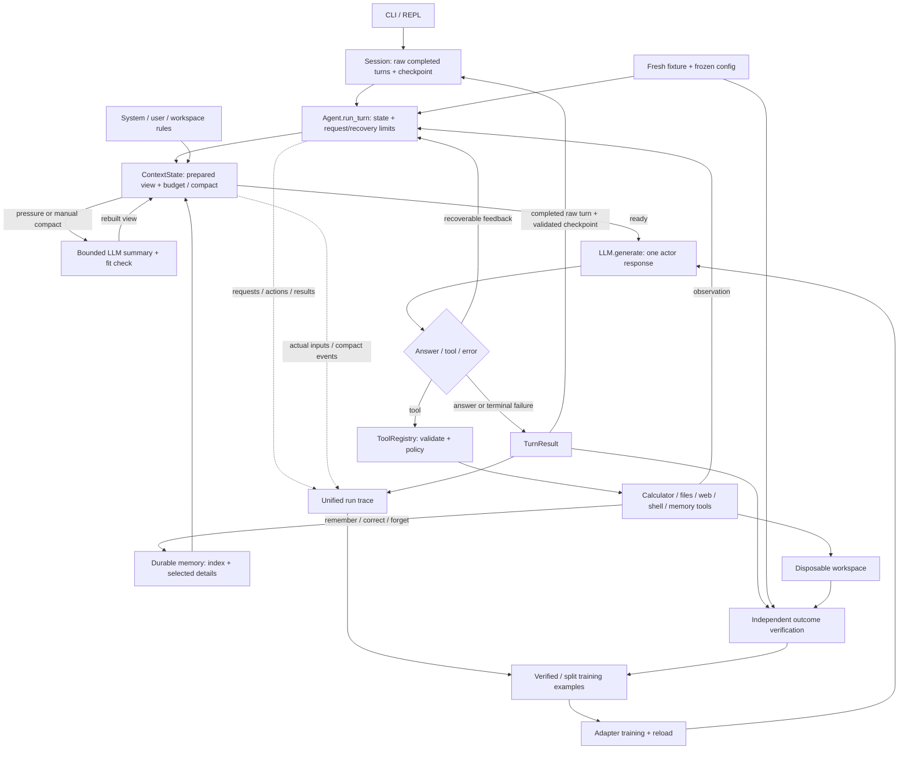

# Build a tiny agent: a two-week sprint

Updated September 15, 2026. Sprint: **September 13–26**; earlier experiments are carried-in work.
This is the implementation scope. [REPORT_ANALYSIS.md](REPORT_ANALYSIS.md) retains the broader learning rationale.

## The finished project

Build a tiny Python agent to learn, through incremental development, how agent loops,
state/result tracing, error recovery, context compaction, and memory change its behavior.
The deliverable has two parts:

- **A working local agent:** sustained CLI conversations, completed-turn session replay,
  local file reads/writes and execution of configured local scripts, sequential dependent
  tool calls, traceable actions/results, and bounded recovery from common errors.
  Long conversations can compact and continue; explicitly saved knowledge can survive a new session.
- **A post-training experiment:** adapt a trainable base checkpoint with an actual weight
  update, reload it, and use a reproducible benchmark to test whether agent capability improves.
  Aim for gains in completion, recovery, and stopping; report failures and regressions honestly.
  Better prompts or memory alone do not count as post-training.

Use disposable text/JSON workspaces as a small test environment. A representative demo:
inspect files → update a requested value → run a local script/check → use its feedback →
report the observed result → continue the conversation after compaction/restart.
This demonstrates mechanisms; it does not require a general assistant or a vertical-domain product.

**Outside this sprint:** a production coding workflow with edit review/revert guarantees;
local/WeChat/cloud deployment; streaming; asynchronous or concurrent calls; third-party
skills/MCP integration; multi-agent collaboration; background jobs. Stages 4C and 5–7
remain optional future learning branches. Basic synchronous web fetch belongs to Stage 2.

Protect time for both runtime and training: target the small Stages 2–4 core first,
then benchmark/data/training in the second week. These are planning checkpoints, not
completion claims. If work overruns, reduce mechanism breadth and label smaller experiments
as pilots; mark missing required outcomes incomplete instead of silently extending the sprint.

### Implementation order and concrete outputs

| Order | Stage / status | Concrete output |
|---|---|---|
| Carried in | **0.5 — complete** | One user request → model/tool/result loop, validated contracts and error feedback |
| Completed | **1 — complete** | Multiple user turns, persisted Session history, structured per-turn state and traces |
| Completed | **2 — implementation complete** | 2A reviewed; 2B dev baseline 8/17 → selected prompt 12/17; gaps/costs recorded |
| Next | **3 — required** | Layered prompt, token budget, manual/automatic compact, replayable checkpoint |
| Next | **4A–4B — required** | Bounded durable memory, search/read, correction/forget, fresh-session recall |
| Before training | **8 — required** | Resettable benchmark, isolated splits, measured baseline, frozen harness |
| Research | **9 — draft, required outcome** | Verified trajectories → adapter update/reload → base/adapter comparison |
| Later experiment | **10 — draft, conditional** | Reward study; online RL only if justified |
| Delivery | **11 — draft, required outcome** | Held-out results and reproducible demo; automated search optional |
| Future branches | **4C / 5 / 6 / 7 — optional** | Dream / skills and MCP / jobs / child agent and planning |

Numbering follows the scratch notes: old Stage 1.1 is now Stage 1; old 1.2 tools move
into Stage 2, alongside its original behavioral evaluation. The original Stage 2 session
plumbing is already complete in Stage 1. Historical evidence filenames keep their old numbers.

### Coding rules for me and AI

- Use ordinary functions/dataclasses and the standard library where practical.
- Implement and explain the loop, context, tracing, tool boundaries, memory, recovery,
  and training-data logic myself. Use AI for review, fixtures, boilerplate, and debugging.
- One tool call per model response; dependent calls run sequentially. Keep the binary calculator.
  Add modules only when needed; no framework rewrite, event bus, provider catalogue, or UI project.
- Aim for roughly 1,500–2,000 runtime lines; review scope around 2,500. Count tests and
  eval/training separately. This is a design alarm, not a reason to compress readable code.
- Each stage leaves a small demo, a deliberate failure, and evidence of what changed.
  Use focused tests for state and side effects, real-model runs for capability; keep those claims separate.

## Stage 0.5 — one request with an agent loop · complete

- [x] Local Qwen/llama.cpp inference, response parsing, tool dispatch, and calculator.
  One user request can contain several model → tool → observation iterations before a final answer.
- [x] Validate response structure and tool arguments before execution; return parse/tool
  errors to the model as feedback, with a bounded request count.
- [x] Model the scratch-note concepts with the current `LLMResponse`, `ResponseError`,
  `ToolResult`/`ToolErrorCode`, and `TurnResult`; no renaming to `ResponseResult`/`ToolError` is required.

**Capability gained:** tool use within one request. Cross-request conversation belongs to Stage 1.
Evidence: [baseline notes](day01_stage0.5.md).

### My Takeaways (AI is NOT ALLOWED to edit)

- Load only the required quantized files, for example
  `hf download Qwen/Qwen2.5-7B-Instruct-GGUF --include "qwen2.5-7b-instruct-q4_k_m-*.gguf"`.
  The previous note recorded roughly 4.68 GB; treat that as a historical observation.
- Model loading, reuse of a loaded model, and prefix/KV-cache reuse are different.
  A `prefix-match hit` log concerns inference reuse, not cross-turn conversation
  memory. `verbose=False` is already present for llama.cpp logging.
- SOLVE ONE PROBLEM AT A TIME, FIND THE GAP IS THE KEY. Predict where messages append and why a
  loop exits before adding another mechanism.
- A **tool** is callable code with an argument/result contract. A **skill** is
  reusable instructions plus optional resources/scripts; it can guide several
  tools, but is not itself necessarily executable code. Stage 5 implements discovery
  summaries and loading separately from dispatch.
- Keep Qwen parsing a compatibility fallback; do not detect calls from a loose
  substring, fabricate a tool result for an unparsed call, or add JSON repair machinery.
- A list of tool calls, an arithmetic-expression tool, and concurrent tool execution
  remain optional later comparisons. If an expression tool is ever added, use a
  restricted arithmetic parser, never unrestricted `eval`.

### My Scratch Notes (AI is NOT ALLOWED to edit)
1. Stage 0.5: one-turn with llm calling and basic tool calling enabled, e.g. single user_input -> llm.generate() -> tool call -> result per turn. Guard with tool schema validation, reponse validation and parsing, error capture and ingested back to model. You should has some data modelling designed for `ToolResult`, `ToolError`, `ResponseResult`, `ResponseError` and `TurnResult`.
2. Stage 1: 
- From one-turn to multi-turn interactions. This is where the `Session` is first developed and conversation is preserved for history. Record such as messages, state (stop_reason, error etc.) should be stored in a strucuted way per turn. 

## Stage 1 — multi-turn sessions and observable execution · complete

Read: book Chapters 1 and 3; Appendix A.1/A.5/A.8. Nanobot: [runner][nb-loop] and
[session history][nb-session] separate the execution lifecycle from conversation replay.
Our `SessionStore` keeps that distinction without Nanobot's channels, hooks, or streaming.

- [x] Preserve conversation across user turns; support `/new`, `/reset`, `/session <id>`.
  `run_turn` receives history explicitly; the REPL loads completed turns from disk.
- [x] Keep structured **session → run → model request/tool result** records: IDs,
  ordered messages, raw responses, errors, stop reason, settings, elapsed time, and available usage.
  Call IDs join requests to results. Run schema is v2; session schema is v1, with legacy readers.
- [x] Distinguish `final_response`, `max_iterations`, `no_progress`, `model_error`, and
  `interrupted`. Parser/tool failures get targeted feedback; three identical consecutive
  failures stop the loop. Backend errors stop cleanly; Ctrl-C retains available run evidence.
- [x] Replay only completed turns. Failed/interrupted runs remain trace evidence;
  independent trace/session write failures do not erase previously saved state.

**Completion boundary:** Stage 1 is complete for this rescope; context management remains
Stage 3. Persistence is single-writer and saved at turn end, without exact mid-turn crash resume.
The [foundation checkpoint](../evals/FOUNDATION_CHECKPOINT.md) records 82 deterministic tests
and real-model smoke results; those are historical evidence, not tests rerun by this document edit.
A terminal answer still does not prove task success; premature stopping is an observed model gap.

## Stage 2 — file, web, shell tools and the first behavioral baseline · implemented

Read: book Chapters 1/3/4; Appendix A.1/A.3/A.5/A.8. Keep the lifecycle explicit:
**parse → registry/schema validation → execution policy → execute → result/error → next iteration**.
Prompt rules describe expected behavior; runtime enforces paths, allowed operations, and budgets.

### 2A — finish the small tool set · complete, reviewed

- [x] Inject a registry per agent; schemas reflect that registry. Existing `tools/files.py`
  (the file tool referred to as `file.py`) provides `list_files`, `read_file`, `write_file`.
  Preserve resolved-path/symlink boundaries, bounded UTF-8 reads/writes, byte ranges,
  continuation offsets, and file-change checks. Full-file replacement is enough.
- [x] **`tools/web.py`:** synchronous `web_fetch(url)` for text/HTML/JSON; return requested/final
  URL, status, extracted text, and truncation flag. Use configured HTTPS hosts, validate each
  redirect, and cap redirects, time, downloaded bytes, and returned text. Treat pages as
  untrusted evidence. Exercise one saved-page fixture and one live documentation page.
  Search, browsers, login, and provider fallbacks are outside this minimal tool.
- [x] **`tools/shell.py`:** synchronous `shell(command_id)` maps configured names to fixed
  argv, workspace cwd, and timeout, including a trusted local script and a fixture check.
  Return exit code, capped stdout/stderr, truncation, and timeout/interruption status;
  clean up owned processes on timeout/Ctrl-C. No arbitrary command strings or execution
  of model-authored programs. Keep verifier code outside writable fixtures.
- [x] Make denials and failures visible through `ToolResult` and the same run trace.
  On interruption, record a pending call as interrupted/unknown if no result exists;
  never imply it succeeded or automatically replay its side effects. Keep the REPL usable.

Evidence: [2A checkpoint](../evals/TOOLS_CHECKPOINT.md), 102 tests, real TLS/subprocess
checks, and saved model traces; code/demo reviewed. Its three autonomous smoke failures
remain historical evidence; the fixed 2B suite below supplies the current behavioral baseline.

**Nanobot comparison:** [registry][nb-registry] validates and feeds errors back;
[filesystem][nb-files] separates read/write path resolution; [shell][nb-shell] implements
process cleanup and output limits; [web][nb-web] records extraction/redirect/truncation data.
Borrow those contracts. Our fixed commands and allow/deny policy are deliberately smaller
than Nanobot's general shell and the book's allow/deny/ask approval system. Out-of-policy
operations stay denied; an interactive approval engine is deferred. A cwd is not a sandbox.

### 2B — first behavioral baseline · complete

- [x] `evals/run.py` + `verify.py` reuse foundation read-coverage checks. **17 dev tasks**
  cover dependent inspection, constrained changes, matched recovery, stopping and calculator.
  Rows specify prompt, fixture, tools, budget, verifier, evidence/constraints and split.
- [x] Allocate skeletons before variants; use fresh temporary files and session state per run.
  Fixed Python verifiers inspect artifacts and actual source reads after the ordinary loop ends.
  Recorded web results isolate behavior from network changes; 2A retains live-fetch evidence.
- [x] Save task outcomes, call/error counts, paired recovery, reviewed false completion,
  unintended writes, requests/usage/latency, settings and code/fixture hashes. Missing usage
  stays unknown. Train/test skeletons are reserved; their task sets are not yet generated.

**Evidence:** [2B checkpoint](../evals/BEHAVIOR_CHECKPOINT.md), **118 tests**, 17/17 scripted
solutions; prompt ablations improve **8/17 → 12/17 strict passes**, retaining all original passes.
The full prompt fixes no-op behavior; nested edits, web JSON/recovery and two answer formats
still fail. Two false claims and one unintended-write task remain. The selected prompt trades
fewer side effects than shorter candidates for higher generation cost: 78 → 270 seconds.
Bad arguments/blocked commands and follow-up/reload/reset have scripted regression coverage;
real dev tasks exercise path denial, fetch failure and timeout. Fake “done” artifacts fail.
Implementation/baseline are complete; reliable autonomous completion remains a measured goal.

## Stage 3 — context construction and compaction · required

Read: book Chapters 2/3/5; Appendix A.1/A.2/A.4/A.5. Nanobot:
[context assembly][nb-context], [accepted history versus unsent delta][nb-governance],
and [summary checkpoint][nb-summary]. Apply the mechanisms to our measured window;
the book's token constants and vendor-specific recovery paths are not our configuration.
Design decisions: [tool-result semantics and state ownership](CONTEXT_STATE_DESIGN.md).

### 3A — one prompt path and a visible budget

- [ ] Add `context.py`: one builder used **before every generation**, including after tools.
  Separate stable instructions, durable memory data, session summary/history, and current
  input/tool observations. Keep raw history distinct from the model-facing view.
- [ ] Organize `prompts/system.md` into purpose, behavior, tools, and reporting rules.
  Load only an explicitly configured user instruction file and workspace-root `AGENTS.md`.
  Use a documented order (system → user rules → workspace rules), source hashes, and caps;
  preserve the runtime contract, and give current user corrections priority over saved preferences.
  Source order aids inspection; it does not itself enforce model compliance. Reload rules at
  turn/compact boundaries; no ancestor crawling, imports, or autonomous rule edits.
- [ ] Count the actual formatted prompt, including schemas/role markers, with the generation
  tokenizer; label any conservative fallback estimate. `/context` shows component sizes,
  window, reserves, and remaining room without calling the model. Stale usage and KV-cache
  hits do not measure the next changed prompt or enlarge the context window.
- [ ] Require `prompt + response reserve + margin <= window`; trigger compact early enough
  to leave headroom for a bounded tool exchange. Budget summarizer input/output independently.
  Measure small-window settings and tool-output caps; oversized pinned input stops explicitly
  as `context_limit`, without silently truncating the request, rules, or claimed file coverage.

### 3B — compact and continue the same task

- [ ] Implement `/compact [focus]` and automatic compact with one function and
  `prompts/compact.md`. Summarize goal, constraints, observed progress, errors/corrections,
  and next steps; keep instructions, current request, recent complete tool pairs, and every
  observation not yet sent to the actor. Track that last-sent boundary separately.
- [ ] Compact old turns first, then older complete exchanges within a long ongoing turn.
  Never split a call/result pair. Rebuild the prompt with summary + retained suffix + fresh
  observations, reload stable rules and bounded memory, then recheck fit before publishing it.
- [ ] Keep run ID, iteration/failure counters, registry, and actual workspace state intact.
  Do not replay tools or treat summarized file state as current without rereading when needed.
  For truncated model output, reuse bounded correction feedback; never execute a partial call.
- [ ] Bound recovery: at most two summary calls per attempt, four per run, and one attempt
  at an unchanged boundary. Count summary requests in total cost/request limits. A failed or
  still-oversized candidate preserves raw evidence and the prior checkpoint, then stops with
  `context_limit`; repeated compaction cannot reset the task budget.

### 3C — persist and inspect the continuation

- [ ] Save a versioned summary checkpoint with stable raw boundary, source digest, and
  summary configuration. Persist raw new-turn messages before publishing a checkpoint
  referencing them. Save an explicit raw turn delta, not a slice of compacted messages.
- [ ] Replay summary + uncovered raw suffix on restart. Invalid/stale checkpoints fall back
  to raw history and its budget check; `/reset` also clears the session checkpoint.
  Incomplete turns stay evidence only; exact mid-tool resume remains outside scope.
- [ ] Extend the existing trace with actual model-facing inputs, purpose (`agent`/`compact`),
  boundaries, usage, and before/after sizes. Preserve old readers and update eval export.
  This is also the input record needed later for truthful training examples.

**Gate/output:** a multi-turn conversation and a long single turn compact twice and continue
without losing the current request/correction, duplicating a write, or resetting limits.
Test pressure immediately after a tool result/parser error, a failing summarizer, checkpoint
write failure, and restart. Keep prompt-size measurements and real-model retained/lost facts
in `docs/context-memory.md`; compare full history versus compact on tasks fitting both.

## Stage 4 — durable memory · 4A–4B required

Read: book Chapters 2/5; Appendix A.4/A.8. [Nanobot memory][nb-memory] separates an archive
journal from durable facts, with [Dream-managed memory rules][nb-memory-skill]. Its builder
loads full `MEMORY.md`; our short index and explicit update tools below are intentional adaptations.

### 4A — bounded index and on-demand detail

- [ ] Add `memory.py` with one project-scoped canonical `memory/state.json`: stable key,
  title, detail, kind, source references, updated time. Single writer, atomic replacement.
  Render `MEMORY.md` as a derived short index; never preload the whole store.
- [ ] Register `memory_remember`, `memory_search`, `memory_read`, `memory_forget` through
  the existing tool contract. Use keyword search and bounded results; update by stable key.
  Cap entry size/count, index tokens, and reads. Omitted index entries remain searchable;
  show omissions/capacity errors instead of silently evicting facts.
- [ ] Store memory outside resettable task fixtures with explicit workspace identity.
  `/new` and `/reset` preserve durable memory; forgetting is explicit. `/memory` inspects
  scope and size. File tools cannot access another workspace's memory.

### 4B — provenance, corrections, and recall

- [ ] Save stable preferences, explicit feedback, and useful references; keep current task
  progress in the session summary. Sources identify user statements, observations, or inferences;
  the host attaches valid current source IDs or validates supplied IDs. Origin is not proof of truth.
- [ ] Trace corrections/forgetting; current user instructions override stored preferences.
  Retrieve relevant details through normal tools, tracing selected keys/hashes. Reattach only
  bounded relevant memory after compact; no background note writer or rule-file rewriting.
- [ ] Add bounded `memory_search(scope="session")` over the current session's retained raw
  evidence to recover a detail omitted by compact. Return source IDs/excerpts and a partial-search
  notice at the scan cap. No cross-project/session scan or automatic promotion into durable facts.

**Gate/output:** session A saves a preference, B corrects it, and clean session C recalls the
correction. Check forget, capped-index retrieval, workspace isolation, invalid provenance,
interrupted writes, and recovery of an omitted session detail. Compare memory off/on from the
same starting facts; save misses as well as successes in `docs/context-memory.md`.
Memory changes context, not model weights. No embeddings, memory graph, or automatic profiling.

### 4C — archive and Dream · optional, outside the sprint

Close a session into a bounded archive; `/dream` processes only new records and proposes
validated facts/corrections. Commit memory changes and processed cursor together; malformed
output preserves the cursor, and a second run without new records does nothing. Keep archive,
compact, and Dream boundaries separate. No shell, skill rewriting, or background job dependency;
direct memory updates work without Dream. Disable Dream in the primary training comparison.

## Stage 5 — skills and one MCP integration · optional, outside the sprint

Keep catalog → selected skill body loading, three small memory/web/shell instruction skills,
one attributed vendored skill, and one allowlisted local stdio MCP tool through the registry.
Reuse Stage 2 web fetch; do not rebuild it here. Bound instruction text, validate supported schemas,
keep SDK async details inside the adapter, and close server/process resources on errors.
**Gate:** unloaded bodies are absent; skill-guided use and a real MCP transport call appear in
ordinary traces; unknown tools, dead servers, and timeouts fail cleanly. Nanobot: [skills][nb-skills].

## Stage 6 — background work and recurring jobs · optional, outside the sprint

Keep SQLite job state, `tick(now)`, one sequential worker, occurrence IDs, status/result/cancel,
and restart handling. Jobs get isolated fixtures/sessions; serialize model and memory access.
Pending cancellation prevents execution; running work stops at supported boundaries and cleans
up owned processes. Mark interrupted occurrences, avoid duplicate ticks/backlog bursts, and never
replay uncertain side effects automatically. **Gate:** fake-clock one-shot/recurrence/cancel and
restart demos. No daemon/distributed scheduler. Nanobot reference: [cron service][nb-jobs].

## Stage 7 — one child agent and explicit planning · optional, outside the sprint

Keep synchronous `delegate(task)` using the same loop, fresh context, read-only tools, depth one,
four child steps, and at most two delegations. Link child/parent traces and charge shared budgets;
parent owns synthesis and the final answer. Compare direct vs inspect/edit/check plan, then
parent-only vs child-assisted runs separately on the same six dev tasks. **Gate:** useful evidence
returns; prohibited writes/recursive delegation never execute; exhaustion is visible. No teams or
concurrent writes. Nanobot reference: [restricted subagent][nb-child]; this design stays synchronous.

## Stage 8 — benchmark and harness freeze · required

Build on Stage 2 after Stages 3–4A/B. The local workspace is a learning benchmark, not a domain product.

- [ ] Cover inspection/reporting, constrained updates, recovery/verification, and appropriate
  stopping with roughly 2–6 dependent tool interactions. Vary layout, distractors, values,
  dependency chains, and fault positions; allow multiple valid solutions.
- [ ] Keep train, dev, and final test isolated by task skeleton before creating variants;
  reset workspace/session/memory per task. Start from the 12–20 dev cases; target 50–100 reserved
  final cases if affordable, explicitly labelling smaller samples as pilots. A public benchmark
  subset is optional; identify adaptations and never present a local score as its official score.
- [ ] Verify final artifacts/constraints independently. Report counts/denominators, false
  completion, invalid calls, matched-fault recovery, stopping, tokens, requests, latency, and cost.
  Keep long-session/compact/restart and delayed-memory recall in separate harness evaluations.
- [ ] Compare full history/compact on fitting tasks and memory off/on from identical facts.
  Freeze code, prompts, tools, checkpoint/template, decoding, budgets, compact policy, memory
  snapshot/policy, task splits, and verifiers before comparing weights.
- [ ] Run the intended trainable checkpoint as the base control. Primary weight comparisons
  use short tasks and disabled or identical read-only memory; no cross-task accumulation or
  evaluator coaching. For long-context comparisons, hold the summarizer checkpoint/config fixed.

**Gate/output:** scripted valid solutions pass and fake “done” outputs fail; real-model baseline
includes interpretable failures. Save task-level results and a frozen manifest in `docs/benchmark.md`.
Fix protocol/evaluator bugs before training; do not require the base model to solve every task.

## Stage 9 — verified trajectories and adapter SFT · draft

**Required outcome; details will be rescoped near Stage 8.** Choose a trainable checkpoint and
compute cap; validate its tool template. Generate short trajectories in real resettable fixtures,
verify outcomes, deduplicate/split, and supervise intended assistant actions/answers with correct
loss masks. Begin with a tiny overfit/save/reload smoke test, then a small LoRA/QLoRA pilot.
**Output:** changed adapter weights reloaded into the ordinary loop, dataset/config records, and
a dev comparison against the same checkpoint/backend/precision with adapters disabled. The current
GGUF runtime is engineering evidence, not automatically the training format or comparison control.

## Stage 10 — verified rewards and outcome learning · draft, conditional

After SFT, test terminal outcome rewards, reset behavior, and reward exploits. Attempt online RL
only if success varies, rewards are trustworthy, and measured rollout cost fits the chosen cap.
**Output if selected:** reward diagnostics and, only if actual updates/reload occurred, an RL
comparison against SFT under the same harness. A reward lab alone is not an RL-trained model.

## Stage 11 — final comparison and delivery · draft

**Required outcome:** after dev selection, run the frozen base and chosen adapter on the reserved
test set. Report paired wins/losses, counts, costs, uncertainty, regressions, and limitations;
do not promise gains or treat a local improvement as broad agent generalization. Package setup,
fixture reset/eval, adapter reload, and a demo covering tools → recovery → compact → restart →
corrected memory. Keep `docs/results.md` and `docs/demo.md`. Bounded automated hypothesis search
remains optional and dev-only; missing runtime/training evidence stays explicitly incomplete.

## Reference map and next step

The book's [Ch. 1][ch1], [Ch. 2][ch2], [Ch. 3][ch3], [Ch. 4][ch4], [Ch. 5][ch5], and
[Appendix A][appendix] supply design questions, not a parity checklist. Apply A.1–A.5/A.8
to Stages 1–4; defer streaming, concurrency, hooks, approval UI, A.6 multi-agent, and A.7 team rollout.
This sprint uses disposable fixtures and explicit outcomes instead of a coding-agent rollback system.

Nanobot links below refer to inspected local source at commit
`0b1fa0c3e44510e3d34d9bed4d491884cb19de7e` (shakewingo fork of HKUDS/nanobot).
Our synchronous loop, fixed commands, capped memory index, and explicit failure policies are
smaller implementations of selected ideas, not claims of identical behavior.

**Next coding session:** Stage 3A's raw transcript/model-input separation and visible budget.
Complete Stage 3's context/compact/replay block and Stage 4A–4B memory before the
Stage 8 freeze. For each session record: what I built, what I broke, what the evidence shows,
what I can explain unaided, and the next smallest gap.

[ch1]: ../../../harness-books/book1-claude-code/chapter-01-why-harness-engineering.md
[ch2]: ../../../harness-books/book1-claude-code/chapter-02-prompt-is-control-plane.md
[ch3]: ../../../harness-books/book1-claude-code/chapter-03-query-loop-heartbeat.md
[ch4]: ../../../harness-books/book1-claude-code/chapter-04-tools-permissions-interrupts.md
[ch5]: ../../../harness-books/book1-claude-code/chapter-05-context-memory-compact.md
[appendix]: ../../../harness-books/book1-claude-code/appendix-a-checklists.md
[nb-loop]: ../../../nanobot/nanobot/agent/runner.py
[nb-session]: ../../../nanobot/nanobot/session/manager.py
[nb-registry]: ../../../nanobot/nanobot/agent/tools/registry.py
[nb-files]: ../../../nanobot/nanobot/agent/tools/filesystem.py
[nb-shell]: ../../../nanobot/nanobot/agent/tools/shell.py
[nb-web]: ../../../nanobot/nanobot/agent/tools/web.py
[nb-context]: ../../../nanobot/nanobot/agent/context.py
[nb-governance]: ../../../nanobot/nanobot/agent/context_governance.py
[nb-summary]: ../../../nanobot/nanobot/session/summary.py
[nb-memory]: ../../../nanobot/nanobot/agent/memory.py
[nb-memory-skill]: ../../../nanobot/nanobot/skills/memory/SKILL.md
[nb-skills]: ../../../nanobot/nanobot/agent/skills.py
[nb-jobs]: ../../../nanobot/nanobot/cron/service.py
[nb-child]: ../../../nanobot/nanobot/agent/subagent.py

## The small architecture you will grow

Reuse `agent.py`, `llm.py`, `session.py`, `trace.py`, and the implemented tools; add `context.py`,
`memory.py`, and `prompts/compact.md` when their stages start. Keep result records scoped;
introduce small loop/context state only where continuation needs shared mutable state.
Keep the configured state root (`outputs/sessions` today); add memory/checkpoint records
there as needed. Raw history, active prompt, durable memory, trace evidence, and training
examples have different roles. Optional branches are omitted from the required-path diagram.
