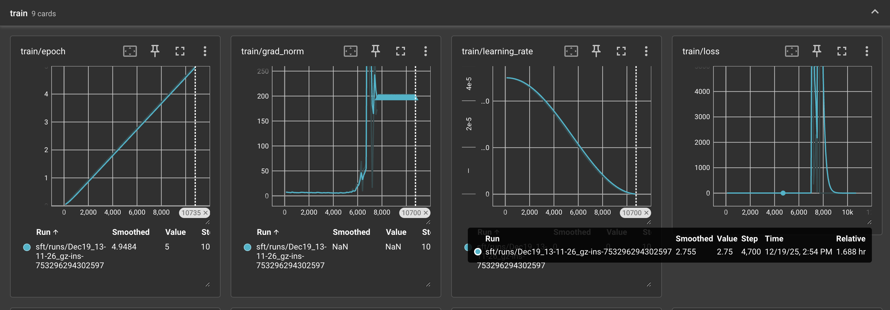
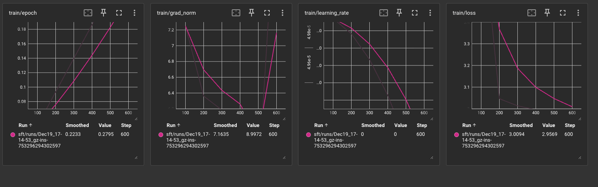

Training job is run in A100-PCIE-40G in GPUGeek w CUDA12.8 which takes around 12hrs in total (6+6 for pretraining and sft sperarately). Below is the requirements:
```
conda create -n sft python=3.12 -y

conda activate sft

pip install torch torchvision torchaudio --index-url https://download.pytorch.org/whl/cu128

pip install tensorboard transformers[torch] tokenizers

# !!!Important - check cuda is available after setup and print model.device() in code!
python -c "import torch; print(torch.cuda.is_available())"
```

Pitfalls Notes:
1. Found that line 126, line 129 in ./train_llama2_from_scratch.py did not have `q_proj` and `o_proj` added to project back to `hidden_size` before, which could impact some accuracy. 
2. I firstly used Lambda Cloud's A100-PCIE-80G but unable to solve SSH connection due to region black I guess, on that machine, the eval_result part is running ok but then switching to A100-PCIE-40G in GPUGeek, it takes forever to give result, so I am guessing it is because by that time, the model loading occurs in CPU which has some bottleneck, so I udpated it to ensure it's reloading in GPU and so is inputs tensors created, then it works.
3. I was lack of modelling experiement for so long, at beginning the SFT train_loss is either too high or 0 and turns out that I dismissed to ensure the learning rate to be much smaller than pretraining, which causes the grads exploding or vanishing. After changing it, the loss is back to normal. First time in SFT training when epoch=5, observed significantally grads exploding and vanishing after epoch=3 (see below ) 
Therefore, I changed to epoch=3 

