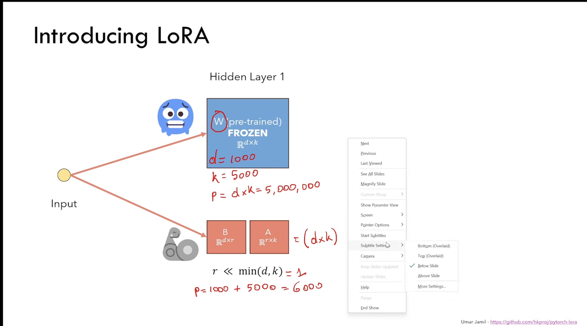

### Notes
1. Split original weights w dim `(D * K)` to be 2 smaller matrix `(D * R)` and `(R * K)` like 
2. Adv: less storage requriement; faster backpropogation
3. Decompose a low-rank matrix by Singular Value Deomposition(SVD), i.e. W = U * S * V, then it's proven that U*S*V = W in pytorch

### 核心观点

1.  **预训练模型有“低内在维度”：** 尽管一个预训练好的神经网络（如大型语言模型）有很多权重矩阵，并且这些矩阵通常是“满秩”的，但研究表明，它们在适应特定任务时，**实际需要**变化的“有效信息”（内在维度）是很小的。
2.  **更新也应该是“低秩”的（假设）：** 受此启发，作者假设，模型权重 $\mathbf{W}_0$ 在适应新任务时所需的**更新量** $\Delta\mathbf{W}$ 也只需要具有一个**低内在秩 (low intrinsic rank)**。
3.  **解决方案 (低秩分解)：** 他们不是直接更新整个巨大的 $\mathbf{W}_0$ 矩阵，而是将更新量 $\Delta\mathbf{W}$ 拆解成两个很小的矩阵的乘积：
    $$\Delta\mathbf{W} = \mathbf{B}\mathbf{A}$$
    其中 $\mathbf{B}$ 是 $d \times r$ 矩阵，$\mathbf{A}$ 是 $r \times k$ 矩阵，而 $r$（秩）远小于 $d$ 和 $k$。
4.  **优点：** 这样做的好处是，只训练 $\mathbf{A}$ 和 $\mathbf{B}$ 这两个小矩阵，而把巨大的原始权重 $\mathbf{W}_0$ 冻结（不更新）。这极大地减少了需要训练的参数数量，从而**提高了训练效率**。

### 关键细节

* **原文引用 (Aghajanyan et al. (2020)):** 这项研究表明，尽管预训练模型很大，但它们可以通过一个随机投影到一个较小的子空间后，仍然能高效地学习，这支持了**“低内在维度”**的观点。
* **更新公式 (Eq. 3):**
    $$h = \mathbf{W}_0 x + \Delta\mathbf{W} x = \mathbf{W}_0 x + \mathbf{B}\mathbf{A} x$$
    这意味着模型在新任务中的输出 $h$ 是由**冻结的原始权重** $\mathbf{W}_0 x$ 加上一个**低秩的适应性更新** $\mathbf{B}\mathbf{A} x$ 组成的。
* **底部总结 (Rank-deficient):** 预训练模型中的 $\mathbf{W}$ 矩阵包含很多**冗余**的参数，它们可以被其他参数的组合表示（即它们是**线性相关**的）。这种有冗余信息的矩阵被称为**秩亏 (Rank-deficient)** 矩阵（即**非满秩**矩阵）。如果能去掉这些冗余，模型的性能并不会下降。